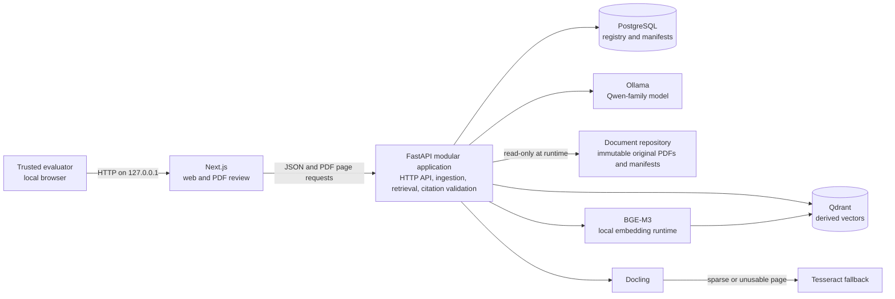
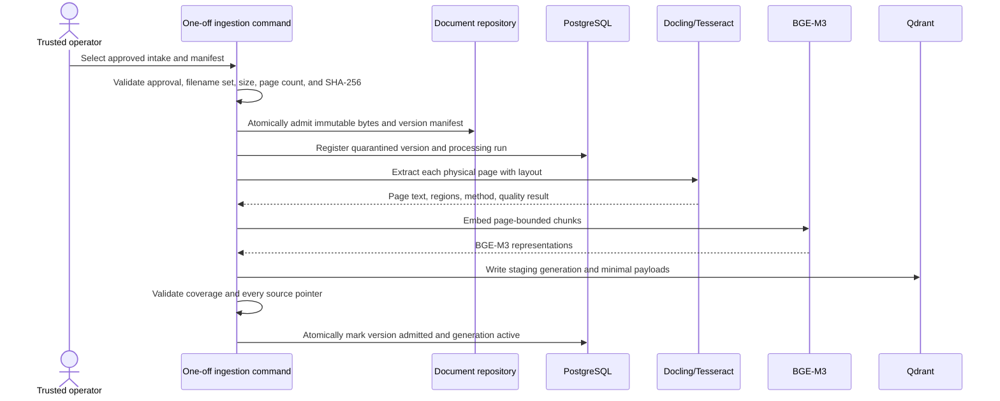
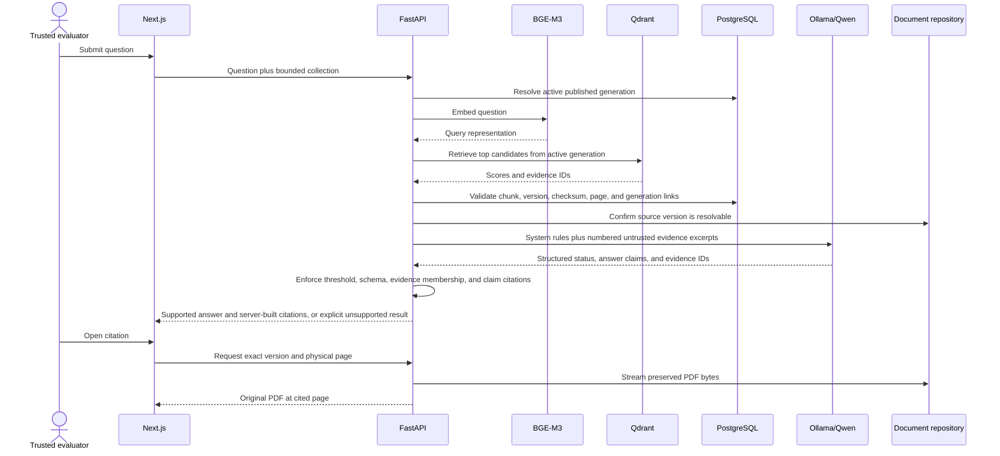

# Kendra Architecture

**Status:** Accepted for the first MVP implementation phase; technical experiments and agency decisions remain open
**Acceptance date:** August 15, 2026
**Last updated:** 2026-08-15

## 1. Decision summary

Kendra's first MVP implementation phase will be a local, single-machine document-retrieval and grounded-answering vertical slice for the approved public evaluation corpus. It will use five long-running Docker Compose services:

- a Next.js web interface;
- one modular FastAPI/Python API that also owns ingestion and retrieval orchestration;
- PostgreSQL for document, processing, publication, and evaluation metadata;
- Qdrant for rebuildable BGE-M3 vectors and retrieval payloads; and
- Ollama for a locally cached Qwen-family instruct model.

Docling, BGE-M3 inference, and Tesseract will run inside the Python application image rather than as separate network services. A reviewed one-off ingestion command will use the same image and application modules; it is not a continuously running worker. Original PDFs will live outside Git in a host folder mounted read-only into the runtime API. Changing that host path to an approved NAS mount later must require deployment configuration, not application changes.

This is the smallest architecture that exercises the documented workflow and evaluation method without introducing microservices, Kubernetes, cloud dependencies, or an observability platform.

## 2. Evidence boundary and milestone constraint

The architecture is constrained by the [product brief](PRODUCT_BRIEF.md), [user workflows](USER_WORKFLOWS.md), [data governance](DATA_GOVERNANCE.md), [threat model](THREAT_MODEL.md), [evaluation method](EVALUATION_METHOD.md), and [source-of-truth policy](source-of-truth-policy.md).

The repository establishes these binding invariants:

1. The exact preserved document version is authoritative; extracted text, OCR, chunks, vectors, database rows, and generated answers are not.
2. A citation must resolve to a stable document identifier, exact version or checksum, exact source location, and producing pipeline or Git revision.
3. A changed byte sequence creates a new version; existing cited bytes are never overwritten.
4. The system must abstain when permitted evidence is absent, conflicting, below the retrieval threshold, or not resolvable to the preserved source.
5. Document content is untrusted evidence, never an instruction to the model or application.
6. Generated answers assist human review; they do not decide currentness, applicability, legal meaning, procurement action, or approval.

Authentication is deliberately excluded from the first MVP implementation phase. Therefore this architecture **does not satisfy confidential or multi-user authorization requirements**. The implementation phase must be bound to `127.0.0.1`, operated by one trusted evaluator on a physically controlled workstation, and restricted to the approved public BIR evaluation sample. Ingesting real agency, personal, confidential, case-restricted, or mixed-permission documents is blocked until identity, authorization, session, audit, and offline-revocation decisions are approved and implemented.

## 3. Scope

### Included in the first MVP implementation phase

- ingest the checksum-approved, bounded PDF evaluation corpus;
- preserve one-based physical PDF page boundaries through extraction and chunking;
- use Docling first and Tesseract only for pages that fail an extraction-quality gate;
- generate BGE-M3 embeddings locally and store them in Qdrant;
- retrieve evidence from one published index generation;
- generate a short answer or explicit unsupported response through local Ollama/Qwen;
- create claim-level citations from API-owned evidence records;
- open the exact original PDF at the cited physical page for human verification;
- run entirely without internet after images, packages, and model weights have been staged; and
- record enough source, pipeline, model, prompt, and Git revision data to reproduce evaluation runs.

### Explicitly excluded

- authentication, accounts, roles, permission administration, and multi-user sessions;
- real confidential, personal, procurement-sensitive, privileged, or case-restricted documents;
- public or cloud routing, external model calls, telemetry export, or online fallback;
- Kubernetes, service mesh, event bus, distributed job system, or independently deployed microservices;
- an observability platform, alerting stack, or security-information system;
- automated legal/currentness/applicability decisions, workflow approvals, or records disposition;
- high availability, automatic failover, production backup claims, and production RPO/RTO;
- corpus federation, synchronization, NAS deployment, or background source watching; and
- generated-answer reuse as authoritative evidence.

## 4. Logical architecture

The boxes are logical responsibilities, not all separate services. `Docling`, `Tesseract`, and `BGE-M3` are Python-process dependencies inside the API image. This avoids network contracts and deployment units that provide no milestone value.

### Docker Compose services

| Service | Responsibility | Persistent state | Exposure |
|---|---|---|---|
| `web` | Next.js question form, answer display, citation list, and source-page viewer | None | Loopback host port only |
| `api` | FastAPI endpoints; source resolution; ingestion command modules; extraction, chunking, embedding, retrieval, grounding, and evaluation orchestration | None in the container | Available to `web`; any host debug port is loopback-only |
| `postgres` | Document/version registry mirror, processing manifests, chunk metadata, index-generation publication state, and evaluation run metadata | Named local volume | Compose network only |
| `qdrant` | BGE-M3 vector collections and payloads tied to one index generation | Named local volume | Compose network only |
| `ollama` | Local Qwen-family inference and model cache | Named local volume | Compose network only |

The source repository is a host bind mount, not a service or Docker volume. The runtime API mounts it read-only. A one-off, explicitly invoked admission command may mount a controlled intake location and the repository read-write; that command must complete hashing and atomic admission before ordinary ingestion begins.

## 5. Application boundaries

The FastAPI codebase should remain a modular monolith with internal interfaces:

| Module/interface | Responsibility |
|---|---|
| `DocumentStore` | Resolve a logical source URI to bytes; stream a PDF; verify size/checksum; never expose machine paths as identity |
| `Registry` | Read/write document identities, versions, provenance assertions, processing runs, chunks, and active generation state in PostgreSQL |
| `Extractor` | Produce page-scoped derived text/layout using Docling and quality-gated Tesseract fallback |
| `Embedder` | Produce version-declared BGE-M3 representations for documents and queries |
| `VectorStore` | Write a staging collection, search the active generation, and validate payload identity in Qdrant |
| `Answerer` | Send only bounded evidence to the Qwen model and require a structured supported/unsupported response |
| `CitationResolver` | Validate model-selected evidence IDs and build citations from server-owned metadata |

These interfaces are seams for testing and later replacement, not a reason to create services now.

## 6. Minimum data model

PostgreSQL is a queryable registry and publication coordinator, not the source of authoritative document bytes. A future schema should contain at least:

| Record | Minimum fields |
|---|---|
| `document` | opaque `document_id` |
| `document_version` | opaque `version_id`, `document_id`, SHA-256, byte length, media type, original filename, logical repository URI, provenance, admission state |
| `processing_run` | source `version_id` and checksum; Git revision; Docling, Tesseract, BGE-M3, chunker, prompt, and model identifiers; start/result state |
| `page` | `version_id`, one-based physical page, extraction method, quality result, optional source-region map |
| `chunk` | stable `chunk_id`, processing run, page number, text, source-region data, sequence, and content checksum |
| `index_generation` | generation ID, Qdrant collection/configuration, source-set manifest checksum, lifecycle state, and publication time |
| `evaluation_run` | dataset Git revision, source-manifest checksum, fixed configuration, seed, timing context, and output location outside Git |

Qdrant payloads contain only the minimum retrieval fields: `chunk_id`, `version_id`, source checksum, physical page, processing-run ID, and index-generation ID. The API must resolve every hit through the active PostgreSQL generation and source repository before it may support an answer. Qdrant is never the authority for document identity, permissions, or citation text.

## 7. Data flows

### 7.1 Admission and indexing

Rules:

1. Reject the entire evaluation run when approval manifest, filename, checksum, readability, or physical page-count preconditions fail.
2. Chunk boundaries must not cross physical PDF pages. Table blocks should remain together where feasible and retain row/column context.
3. Use Docling output when its page-level quality gate passes. Invoke Tesseract only for image-only or materially sparse/unusable pages, and record the method and version per page.
4. Treat extraction and OCR failures as page-level states, not as empty successful text.
5. Write vectors to a new staging generation. Do not mutate the active generation in place.
6. Publish only after source checksums, chunk coverage, Qdrant payload pointers, and configuration identities agree. On failure, keep the prior active generation and mark the staging generation failed.

### 7.2 Query, answer, and source verification

The model may select only opaque evidence IDs supplied in that request. It may not author filenames, paths, page numbers, checksums, or source metadata. The API builds citation objects from validated registry records. Any invalid schema, unknown evidence ID, below-threshold retrieval set, inactive generation, missing source, or inconsistent checksum forces an unsupported/error response rather than a best-effort answer.

The response status should distinguish at least:

- `supported` — every material claim has one or more validated evidence IDs;
- `insufficient_evidence` — the permitted corpus does not establish the answer;
- `conflicting_evidence` — retrieved sources materially conflict and require human review;
- `source_unavailable` — a required original cannot be resolved or verified; and
- `system_error` — the pipeline could not complete safely.

The first MVP implementation phase has no user authorization context, so it must not use `not_authorized`; that state becomes meaningful only after identity and access control are designed.

## 8. Trust boundaries

| Boundary | What crosses it | Required milestone control | Residual limitation |
|---|---|---|---|
| Browser to local application | Questions, answers, citations, PDF bytes | Bind host ports to loopback; restrictive browser headers; do not place source content in URLs or client logs | No application identity; local OS/physical access is trusted |
| Web to API | JSON requests and source-page requests | API validates sizes, types, IDs, and state; web never addresses storage directly | No per-user authorization |
| API to document repository | Original bytes and manifests | Runtime read-only mount; logical IDs; checksum and path-containment validation | Host administrator can still alter local files |
| Intake to parsers | Untrusted PDFs and images | Quarantine, type/size/page limits, container resource limits, no active-content execution, fail closed | Compose containers are not a complete malware sandbox |
| Derived stores to source evidence | Text, vectors, pointers, generation identity | Every hit resolves to active metadata and an immutable source version; indexes never substitute for originals | Metadata can be corrupt and needs recovery procedures |
| API to model | Question and retrieved document text | Fixed system instruction; document text delimited as untrusted evidence; no tools; no network; structured response | Qwen output remains untrusted until API validation |
| Docker host to internet | Images, packages, model downloads | Stage and verify dependencies before offline use; run the acceptance test with outbound network disabled | Software/model update custody remains an agency decision |
| Future local host to NAS | Source bytes, filesystem operations, mount identity | Treat as a new trust boundary; approve identity, permissions, encryption, snapshots, availability, and recovery before migration | Not implemented or validated in the first MVP implementation phase |

## 9. Grounding and citation invariants

An answer is `supported` only if all of these checks pass:

1. retrieval used the currently published index generation;
2. each selected chunk meets the experiment-derived retrieval rule;
3. each material claim names at least one evidence ID present in the bounded retrieval set;
4. every evidence ID resolves to a chunk, processing run, exact source version/checksum, and physical page;
5. the exact source version is currently resolvable from the document repository;
6. citation metadata is generated by the API, not copied from model text; and
7. no known conflict or missing context makes the claim materially misleading.

Retrieval score is a relevance signal, not proof of support. Model self-report is also not proof of support. Thresholds and prompt/schema rules are safety filters whose actual performance must be established on the versioned evaluation set and reported by category, OCR status, and layout type.

## 10. Failure modes and safe behavior

| Failure | Detection | Safe behavior | Recovery |
|---|---|---|---|
| PDF differs from approved bytes | SHA-256/page-count/manifest mismatch | Quarantine; do not process or score | Reacquire approved bytes and repeat admission |
| Malformed or resource-exhausting file | Parser error, limit breach, timeout, container pressure | Abort that version; preserve a minimal failure record; do not index partial output | Review safely, adjust approved limits if justified, then rerun |
| Docling yields sparse or unusable text | Page quality gate | Run Tesseract for that page; if still inadequate, mark unextractable | Improve scan/OCR configuration or require manual review |
| OCR changes meaning or page mapping | Evaluation mismatch or low quality | Never treat OCR as authority; abstain when original-page support cannot be established | Tune OCR or exclude the page until reviewed |
| BGE-M3 inference unavailable | Health/startup or request error | Do not search or answer from model memory | Restore the pinned embedding runtime/model and rerun checks |
| Qdrant unavailable/corrupt/stale | Health failure or generation/payload mismatch | No grounded answer; do not fall back to cached excerpts | Rebuild a staging generation and republish after validation |
| PostgreSQL unavailable/inconsistent | Transaction or reconciliation failure | Refuse results whose identity, generation, or provenance cannot be verified | Restore/reconcile registry, then rebuild affected derived state |
| Source folder missing or checksum mismatch | Resolution/verification failure | Return `source_unavailable`; never use index text as authority | Restore exact bytes and verify citations before reopening |
| Ollama/Qwen unavailable or invalid output | Timeout, schema failure, unknown evidence ID | Return `system_error` or `insufficient_evidence`; never expose unvalidated prose | Retry within a bounded policy or restore pinned model |
| Evidence below threshold | Retrieval rule | Return `insufficient_evidence` | Human searches originals or corpus is intentionally expanded and re-evaluated |
| Conflicting sources | Competing supported passages/status metadata | Surface conflict and evidence; do not decide which controls | Authorized human adjudicates outside the model |
| Partial indexing failure | Processing state or coverage mismatch | Keep current generation active; never publish staging | Correct the cause and rebuild the failed generation |
| Disk exhaustion | Preflight/capacity check or write failure | Stop derived writes first; never delete originals automatically | Add capacity, remove approved disposable generations, rebuild |
| External network dependency appears | Offline acceptance test or egress observation | Fail the milestone acceptance gate | Pre-stage or remove the dependency; repeat offline test |
| Host or Docker restart | Service state and health checks | Do not serve until PostgreSQL, Qdrant generation, model, and source resolution checks pass | Restart and reconcile; no automatic claim of recovery |

## 11. Hardware and operating assumptions

No target workstation, corpus size, concurrency, or service-level objective is currently documented. The following are planning assumptions, not verified requirements:

- one trusted evaluator and one in-flight generation request;
- a bounded nine-document, 50-case public evaluation corpus initially;
- Linux Docker Engine with Docker Compose is the reference deployment; another Docker-compatible desktop environment may work but is not yet validated;
- 32 GB system RAM is a practical experiment baseline;
- a local GPU with roughly 12 GB or more usable VRAM is a practical baseline for a quantized 7B/8B-class Qwen-family model, while CPU-only inference is functionally possible but may be too slow;
- at least 100 GB free SSD capacity plus corpus growth is reserved for container images, a Qwen model, BGE-M3, PostgreSQL, Qdrant, originals, extraction workspace, and at least one staging index generation;
- Tesseract and Docling processing are CPU-, memory-, and temporary-disk-intensive and ingestion is serialized initially; and
- the deployment can be disconnected after all reviewed images, Python packages, OCR language data, and model artifacts are locally staged.

The exact Qwen model, quantization, context limit, BGE-M3 runtime, CPU/GPU allocation, storage multiplier, and acceptable latency must be selected by experiment. Architecture documents must not turn these estimates into procurement specifications.

## 12. Small experiments required before implementation

These experiments are architecture gates, not optional tuning after the system is built.

| ID | Question | Smallest useful experiment | Decision produced |
|---|---|---|---|
| EXP-01 | Can Docling and Tesseract preserve exact physical-page and table/form context? | Process all nine approved PDFs; compare extracted passages and page mappings for digital, OCR, table-heavy, and form-layout strata against human-opened originals | Extraction quality gate, OCR trigger, page/region representation, and any unsupported document class |
| EXP-02 | Which BGE-M3 retrieval form is sufficient? | With generation disabled, compare dense-only with BGE-M3 dense+sparse Qdrant fusion on the 50 cases; report allowed-page recall at several `top_k` values by stratum | Vector configuration, fusion method, `top_k`, chunk size/overlap, and candidate threshold |
| EXP-03 | Can page-bounded chunks preserve tables and cross-document attribution? | Test several deterministic chunking policies on the table, list, OCR, and comparison cases | Chunk schema and maximum context policy |
| EXP-04 | Which local Qwen variant is safe enough on available hardware? | For two small Ollama-compatible Qwen variants/quantizations, measure structured-schema validity, unsupported false-answer rate, fact/citation scores, warm/cold latency, and peak RAM/VRAM | Exact model, quantization, context size, timeout, and concurrency |
| EXP-05 | Does the two-stage grounding gate reject unsupported output? | Run all deliberately unsupported cases plus synthetic invalid evidence IDs and below-threshold retrievals | Structured response schema, validation rules, abstention wording, and fail-closed behavior |
| EXP-06 | Can every citation reopen the correct original page? | From generated citation objects, open all expected pages in the browser and compare physical page numbering and optional regions | Viewer contract and accepted citation location fields |
| EXP-07 | Is the build genuinely offline? | Pre-stage artifacts, disable outbound networking, restart the Compose project, ingest a clean derived-data rebuild, and run the evaluation | Complete artifact inventory and zero-network acceptance procedure |
| EXP-08 | Is publication atomic across PostgreSQL and Qdrant? | Inject failure before and during generation publication and verify the old generation remains the only searchable one | Publication transaction/state machine and reconciliation procedure |
| EXP-09 | Are parser limits adequate for hostile or accidental inputs? | Use safe malformed, oversized, high-page-count, and image-heavy fixtures under CPU/memory/time limits | Intake limits, quarantine states, and whether stronger isolation is required before broader ingestion |
| EXP-10 | Does the storage abstraction survive a mount change? | Run the same checksum, stream, range-read, atomic-admission, and rebuild tests against two local mount points; use a controlled NAS test only after approval | `DocumentStore` contract and NAS prerequisites without promising NAS compatibility |

Implementation should not begin until EXP-01 through EXP-06 have at least a time-boxed spike plan and pass/fail criteria. EXP-07 through EXP-10 must pass before the architecture is described as offline-ready, generation-safe, or NAS-ready.

## 13. Alternatives considered

| Alternative | Decision | Reason |
|---|---|---|
| Cloud model, embeddings, database, or object storage | Rejected for the first MVP implementation phase | Conflicts with the required local/offline test and creates an unapproved data-routing boundary |
| Kubernetes or multiple independently deployed services | Rejected | No scale, availability, or team boundary currently justifies the operational complexity |
| Separate ingestion worker/queue | Deferred | One operator and serialized ingestion can use a one-off command in the API image; add a worker only when measured workload requires it |
| PostgreSQL as PDF blob store | Rejected | Couples authoritative bytes to a derived registry and makes later NAS migration less direct |
| Qdrant as source or citation store | Rejected | The index is derived and disposable; it cannot establish source identity or authority |
| Pure keyword search | Not selected as the only retriever | Exact terms matter, but semantic and cross-wording cases require evaluation; BGE-M3 sparse+dense fusion remains an experiment within Qdrant, not a new service |
| Dense-only BGE-M3 retrieval | Candidate baseline, not locked | It is simpler, but identifier/table/rare-term performance must be compared with BGE-M3 sparse+dense fusion in EXP-02 |
| Retrieval-only UI with no generated answer | Retained fallback | It is safer and simpler for high-risk workflows; the first MVP implementation phase still tests Qwen because grounded synthesis is an explicit stack requirement |
| Model-authored free-text citations | Rejected | Filenames and page numbers generated by a model are not verifiable provenance |
| Automatic OCR of every page | Rejected | It adds cost and can degrade good text; OCR is a recorded, page-level fallback |
| Direct filesystem paths as document identity | Rejected | Paths change across hosts and NAS mounts; stable IDs, versions, checksums, and logical URIs remain identity |

The decisions are recorded in [ADR-001](adr/001-local-first.md), [ADR-002](adr/002-document-storage.md), and [ADR-003](adr/003-grounded-answering.md).

## 14. Milestone acceptance boundary

Architecture documentation is complete when the four requested records are reviewed and internally consistent. A future implementation milestone is acceptable only when it can demonstrate, rather than merely claim:

- reproducible source-manifest and checksum preconditions;
- correct source-page resolution for the approved corpus;
- page/layout extraction results segmented by OCR and document type;
- retrieval results before generation is enabled;
- server-enforced citation and unsupported-answer behavior;
- evaluation output using the metrics in [EVALUATION_METHOD.md](EVALUATION_METHOD.md);
- successful operation with outbound networking disabled; and
- no real confidential or mixed-permission data while authentication remains absent.
