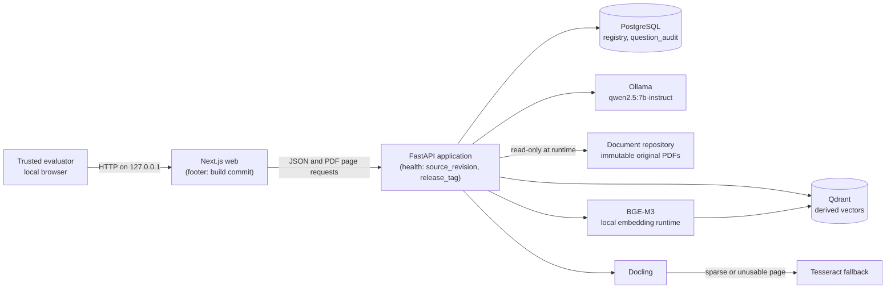

# DOST demonstration release — `demo-dost-v1.1`

**Status:** Milestone 13 demonstration package, current release
`demo-dost-v1.1` (`demo-dost-v1` is superseded — Section 6). This is a
scripted, honest walkthrough of a prototype, not a claim of production
readiness, legal authority, or accuracy guarantees. Read this alongside
[`docs/PILOT_PLAN.md`](PILOT_PLAN.md), [`docs/MVP_SPEC.md`](MVP_SPEC.md), and
[`docs/milestones/M12_STATUS.md`](milestones/M12_STATUS.md), which this
document does not restate or soften.

## 1. What `demo-dost-v1.1` is

A tagged Git commit and a pair of Docker images (`api`, `web`) built from it,
carrying their own commit and tag identity (Section 5) so a reviewer can
confirm exactly what ran. It packages Milestones 1–10 and 12 as they exist on
`main`, plus this milestone's release plumbing, plus a Milestone 13 follow-up
round that fixed a host-permission gap, an evaluation-runner lock-ordering
bug, and brought `CLAUDE.md` current (`v12.md`). It does not add any
answering, retrieval, or extraction behavior beyond what Milestone 12
already merged.

## 2. Seven-minute demonstration guide

Run from a freshly started stack (`docker compose up -d`, all five services
healthy) with `KENDRA_ANSWERING_ENABLED=true` set for the session — Milestone
10 answering is off by default and remains an unaccepted prototype (Section
4). Every question below is asked against the nine-PDF, 50-case public BIR
evaluation corpus already staged in `document-repository/`; `collection_id`
is the fixed value `"default"`, matching what the gold-evaluation runner uses.

### 0:00–0:45 — Show what's actually running, not asserted

```bash
curl -s http://127.0.0.1:8000/api/v1/health | python3 -m json.tool
```

Point out `source_revision` and `release_tag` in the response (Section 5) —
both are baked into the image at build time, not typed in by hand — and the
same commit in the web footer at the bottom of `http://127.0.0.1:3000`.

### 0:45–2:15 — A supported, cited answer (single document)

Drawn from gold case **`KND-M5-DF-009`** — verified fully fact-complete under
labeled rendering in EXP-13 run `20260902T005308Z-35770ed8` (`exp13_summary.md`
Part 1: "Complete — 1/1").

```bash
curl -s -X POST http://127.0.0.1:8000/api/v1/questions \
  -H "Content-Type: application/json" \
  -d '{"question": "Within how many days from the EOPT Act'"'"'s effectivity were implementing rules and regulations to be promulgated, according to RMC No. 3-2024?", "collection_id": "default"}' \
  | python3 -m json.tool
```

Expected: `status: supported`, one claim ("ninety calendar days from the
effectivity of the Act"), one citation into `RMC_03_2024_EOPT_Act.pdf`, page
2. Open the citation's `source_url` to show the original page.

### 2:15–3:45 — A supported, cited answer (OCR-derived source)

Drawn from gold case **`KND-M5-DF-020`** — the other case verified fully
fact-complete in the same EXP-13 run (Part 1: "Complete — 2/2").

**Correction to the milestone brief that requested this demo:** both
`KND-M5-DF-009` and `KND-M5-DF-020` are single-document cases in
`evaluation/gold_cases.json` (one authoritative filename each), not
cross-document comparisons — checked directly against the dataset, not
assumed. They were the two cases in EXP-13's originally-abstained, six-case
set that came back `supported` *and* fully fact-complete under labeled
rendering; the other two newly-`supported` cases in that set
(`KND-M5-CD-005`, `KND-M5-DF-005`) are fact-incomplete and are scripted as
disclosed limitations instead (Section 4), not successes. No genuinely
cross-document case in the qualified set (`KND-M5-CD-004`) came back
`supported` at all — it still abstains (Section 4). This demo script follows
the milestone brief's explicit case-ID constraint; it does not follow its
"spanning two documents" description of those cases, which does not match
the dataset.

```bash
curl -s -X POST http://127.0.0.1:8000/api/v1/questions \
  -H "Content-Type: application/json" \
  -d '{"question": "When did the invoicing provisions of RR No. 7-2024 become effective according to RMC No. 77-2024?", "collection_id": "default"}' \
  | python3 -m json.tool
```

Expected: `status: supported`, one claim stating both required facts (April
27, 2024 effective date; fifteen days from the April 12, 2024 publication),
two citations into `RMC_77_2024_Invoicing_QA_OCR.pdf` page 11 — the 12-page
image-only OCR document, worth noting explicitly since OCR text is never
treated as authoritative and the excerpt should be checked against the
rendered page.

### 3:45–5:30 — Fail-closed abstention, with its audit record

Drawn from gold case **`KND-M5-UN-007`** (deliberately unsupported) — chosen
because it is not a currentness/"is this still in effect" question; the one
required deliberately-unanswerable demo question in this milestone must not
be, except as a disclosed limitation (Section 4, item 3).

```bash
curl -s -X POST http://127.0.0.1:8000/api/v1/questions \
  -H "Content-Type: application/json" \
  -d '{"question": "What exact email address should a taxpayer use to submit Annex C or Annex D reports?", "collection_id": "default"}' \
  | python3 -m json.tool
```

Expected: `status: insufficient_evidence`, answer text exactly `Insufficient
information in the uploaded documents.`, empty `claims`, empty `citations`.

Then show the audit record this abstention produced — the hash-chained,
append-only `question_audit` table, not a log line that could be edited:

```bash
docker compose exec postgres psql -U kendra -d kendra -c \
  "SELECT sequence, question, status, supported, record_hash, previous_record_hash
   FROM question_audit ORDER BY sequence DESC LIMIT 1;"
```

Point out `previous_record_hash` linking back to the prior row, and that no
`UPDATE`/`DELETE` path exists for this table (`apps/api/src/kendra_api/audit/
sink.py`) — this is what INC-001 (Section 4, item 9) relied on to reconstruct
what actually happened after two unnoticed duplicate runs.

### 5:30–7:00 — What this demo does not show, said out loud

Close by stating, not skipping, three things live in front of the reviewer:

1. `KND-M5-UN-002` — a question about whether an issuance is *currently in
   effect* — returns a confident, wrong `supported` answer, not an
   abstention. It is not demonstrated live in this script (per this
   milestone's own constraint); it is disclosed here as a known defect
   (Section 4, item 3).
2. Labeled evidence rendering, the reason the two supported answers above
   work at all, was adopted as the default despite failing its own
   preregistered success bar (Section 4, item 5).
3. Milestone 10 answering — everything just demonstrated — carries
   `acceptance_claim: false` on every evaluation report (Section 4, item 7).

## 3. Architecture

Unchanged from [`docs/ARCHITECTURE.md`](ARCHITECTURE.md) Section 4; reproduced
here for demo convenience with the release-identity additions from Section 5
of this document noted on `api` and `web`:



`Docling`, `Tesseract`, and `BGE-M3` run inside the `api` image, not as
separate services (`ARCHITECTURE.md` Section 4). Nothing in this milestone
changes a service boundary or trust boundary from `ARCHITECTURE.md` Section 8
or `THREAT_MODEL.md` Section 3.

## 4. Honest limitations

1. **Release evaluation accuracy (this milestone's own gold rerun):**
   see Section 6 for the run-id and the measured figure, filled in after that
   run completes. History: `0.72` classification accuracy at the M12 baseline
   (`evaluation/runs/M12-gold/20260831T125331Z-0bcc9dd7/report.json`, unlabeled
   rendering) → `0.82` under labeled rendering in EXP-13's live non-regression
   run (`evaluation/runs/EXP-13/nonregression/20260902T005308Z-35770ed8/report.json`).
   Both figures are on the 50-case `kendra-bir-public-gold-v2` set, whose
   `dataset_status` is `initial_expert_review_required` — not an
   expert-adjudicated benchmark.
2. **Atomic-fact recall is provisional and unscored by a human reviewer.**
   Every run report's `atomic_fact_scoring.status` is `"provisional"` — string
   matching against `expected_answer_facts`, not human judgment
   (`docs/EVALUATION_METHOD.md`'s atomic-fact scoring requires the latter
   before any figure governs a decision).
3. **`KND-M5-UN-002` temporal-boundary defect.** Asked whether RR No. 7-2024
   is still the controlling invoicing regulation as of August 15, 2026, the
   system returns a confident `supported` answer instead of abstaining, from
   a corpus bounded to 2024 documents. Recorded in
   `evaluation/M12_FINDINGS.md` part (a); persists unchanged under both
   rendering modes (`ADR-012` Section 4).
4. **EXP-11's result stands.** A larger same-family model
   (`qwen2.5:14b-instruct`, `B1_LARGER`) did not resolve the six originally
   abstaining cases (answered only 2 of 6) and regressed three previously
   correct cases (`KND-M5-CD-003`, `KND-M5-CD-008`, `KND-M5-LT-009`) on the
   live non-regression set (`evaluation/runs/EXP-11/stage1-20260901T120327Z-221e1bcd/stage1_summary.md`).
   Model size is not adopted as a fix for anything in this release.
5. **Labeled evidence rendering was adopted against its own preregistered
   bar.** EXP-13's frozen decision rule (`docs/experiment-decisions/
   EXP-13-preregistration.md` Section 8) required answering at least 5 of 6
   qualified cases; the run answered 2 of 6. `docs/adr/
   012-labeled-evidence-rendering-default.md` adopts `labeled` as the default
   anyway, on separate net-benefit grounds (accuracy `0.72`→`0.82`, zero
   regressions, zero label leaks) — and states plainly, in its own Section 3,
   that the frozen verdict is not overturned by that adoption. This release
   runs with the adopted default; the frozen experiment's own verdict was
   still "not supported."
6. **Fact-incompleteness defect class.** The system can return a `supported`,
   correctly cited answer that omits a required fact. Two confirmed
   instances, both introduced by labeled rendering: `KND-M5-CD-005` (omits
   the Section 264(a) Tax Code citation fact) and `KND-M5-DF-005` (omits the
   "updating required only when non-fee registration information changes"
   fact) — both 2 of 3 required facts present. `ADR-012` Section 4 states
   plainly that fact completeness is not machine-enforced anywhere in the
   verification contract; only downstream human review catches this pattern.
7. **Milestone 10 is open.** `acceptance_claim: false` on every evaluation
   report this milestone produces, same as every report before it
   (`docs/milestones/M12_STATUS.md`).
8. **Model output nondeterminism observed at temperature 0 with a fixed
   seed.** `ANSWER_NUM_CTX`, `temperature: 0`, and `seed: 0` are all fixed
   (`apps/api/src/kendra_api/answering/model_client.py`), but temperature 0
   alone does not guarantee bit-identical generation run to run
   (`evaluation/M12_FINDINGS.md` part (f)); a fixed seed narrows this, it
   does not eliminate it.
9. **Milestone 11 (OCR quality/render-resolution work) is defined but
   unimplemented.** `ADR-011` is `Proposed`, not `Accepted`, and lives on
   `prototype/milestone-10-verification-contract`, not on `main`. It does not
   block this release; it is roadmap, not a current capability. See Section
   7.
10. **INC-001** (`docs/incidents/INC-001-ghost-evaluation-runs.md`) — two
    unnoticed duplicate evaluation runs wrote 100 real rows into
    `question_audit` in 2026-09-01. Those rows are retained, not deleted —
    the append-only audit design has no `UPDATE`/`DELETE` path by
    construction, and the incident is itself the demonstration that an
    audit trail without deletion is what let the duplication be discovered
    and explained after the fact, rather than silently going unnoticed.

**This system is not production-ready, not legally authoritative, not
hallucination-free, and does not guarantee accuracy.** Every claim above is
sourced to a specific run, report, or document cited inline; none is a
summary judgment offered without evidence.

## 5. Source revision, release tag, and how they are supplied

Both are supplied dynamically, never hand-typed into a committed file:

- **api image:** `apps/api/Dockerfile`'s `runtime` stage takes
  `ARG KENDRA_SOURCE_REVISION=""` and `ARG KENDRA_RELEASE_TAG=""`, each
  baked to a matching `ENV`. `docker-compose.yml`'s `api.build.args` supplies
  both from the host environment (`${KENDRA_SOURCE_REVISION:-}` /
  `${KENDRA_RELEASE_TAG:-}`); `apps/api/src/kendra_api/health.py` exposes
  both as `source_revision` and `release_tag` in `/api/v1/health`.
- **web image:** `apps/web/Dockerfile`'s `build` stage takes
  `ARG NEXT_PUBLIC_KENDRA_GIT_COMMIT=""`, inlined into the client bundle by
  Next.js at `npm run build` time (same mechanism as the existing
  `NEXT_PUBLIC_KENDRA_API_BASE_URL`); `apps/web/src/app/layout.tsx` renders
  it in a page footer via `apps/web/src/lib/config.ts`'s `gitCommit()`.
- **`make build`** (`Makefile`) computes all three from `git` at build time —
  `git rev-parse HEAD` for the two commit variables, `git describe --tags
  --exact-match HEAD` (empty, harmlessly, on an untagged commit) for the
  release tag — and passes them to `docker compose build api web`. Nothing
  is hard-coded in a Dockerfile, compose file, or source file.

## 6. Release gold evaluation

**`demo-dost-v1` is superseded by `demo-dost-v1.1`.** `v1` (commit
`903b1089`) predates the `docker-compose.yml` `ingest`-service
environment-passthrough fix (commit `4b09600`) and cannot be deployed from
scratch as tagged — see Milestone 13's `v11.md` report Section 6 for the
two bugs that fix addresses. `v1.1` (Section 6.2 below) is expected to
deploy from scratch with zero manual intervention now that those fixes are
in place; the from-scratch drill run against the pushed `v1.1` tag itself
(not the working tree) is what will confirm that claim rather than merely
assert it — see the recovery-drill section of this document once that run
completes. Use `v1.1` for any new demonstration; `v1` remains tagged and
unaltered as the historical record it always was.

### 6.1 — `demo-dost-v1` (superseded)

Run against release-candidate commit `903b10895d543bad337cabab97e7e1d8d1ea4690`
(the commit `demo-dost-v1` tags), using the hardened runner
(`kendra_api.evaluation.run`) — named container `kendra-eval-m13-release`, no
`--rm`, default lock path (`evaluation/runs/.lock`), default revision-match
preflight, no `--allow-revision-mismatch`. Not a reuse of the 2026-08-31 M12
runs or any EXP-11 run.

- **Run directory:** `evaluation/runs/M13-release/20260902T022843Z-903b1089/`
  (`evaluation_run_id eval-f0f2fc29-c398-4773-b52e-a4fb7f27a99b`) — preserved
  locally, ignored by Git (`/evaluation/runs/*` in `.gitignore`).
- **`report.json`'s `source_revision`:** `903b10895d543bad337cabab97e7e1d8d1ea4690`
  — matches the tagged commit exactly; `source_revision_mismatch_overridden:
  false` in `run_config.json`.
- **Classification accuracy: `0.82`** (`TP 32 / FN 8 / FP 1 / TN 9`) — the
  single false positive is `KND-M5-UN-002`, the already-disclosed temporal-
  boundary defect (Section 4, item 3), not a new failure.
- **Unsupported false-answer rate: `0.1`** (1 of 10).
- **`question_audit`: 300 before, 350 after — a clean `+50`**, confirmed by
  direct `SELECT count(*)`, with this run's own 50 rows individually
  confirmed by `evaluation_run_id`.
- **Hash chain: `PASS: 350 records, chain verified from genesis`**
  (`scripts/verify_audit_chain.py`), run immediately after.
- All three demo-script cases (Section 2) matched their scripted outcome
  exactly in this run.
- This run's own release-eval attempt needed one retry, mid-run, at the git
  revision preflight (`safe.directory`) — see `v11.md` Section 4. That gap
  is what Task 2 of the Milestone 13 follow-up round fixed; `v1.1`'s own run
  (Section 6.2) needed none.

### 6.2 — `demo-dost-v1.1` (current)

Rerun against release-candidate commit
`6a671dee7df6d8fb263deb4a372f87c91d71816f` (the commit `demo-dost-v1.1`
tags), using the hardened runner with Task 1–2's fixes already in place —
named container `kendra-eval-m13-1-release`, no `--rm`, default lock path,
default revision-match preflight, no `--allow-revision-mismatch`. Not a
reuse of `v1`'s run, the 2026-08-31 M12 runs, or any EXP-11 run.

- **Run directory:** `evaluation/runs/M13.1-release/20260902T044009Z-6a671dee/`
  (`evaluation_run_id eval-f8338dde-fa4f-4b78-b760-a219bf13690e`) — preserved
  locally, ignored by Git.
- **`report.json`'s `source_revision`:** `6a671dee7df6d8fb263deb4a372f87c91d71816f`
  — matches the tagged commit exactly; `source_revision_mismatch_overridden:
  false`.
- **Zero retries needed** — the runner passed its git-revision preflight on
  the first attempt, confirming Task 2's fix.
- **Classification accuracy: `0.82`** (`TP 32 / FN 8 / FP 1 / TN 9`) —
  identical confusion matrix to `v1`'s run; the sole false positive is again
  `KND-M5-UN-002`. Expected: nothing between the two releases changed
  answering behavior (permissions, lock ordering, docs, `CLAUDE.md`).
- **Unsupported false-answer rate: `0.1`** (1 of 10) — unchanged.
- **`question_audit`: 350 before, 400 after — a clean `+50`**, confirmed by
  direct `SELECT count(*)` and by this run's `evaluation_run_id` count.
- **Hash chain: `PASS: 400 records, chain verified from genesis`.**
- All three demo-script cases matched their scripted outcome exactly:
  `KND-M5-DF-009` (`supported`, 1 citation), `KND-M5-DF-020` (`supported`,
  2 citations), `KND-M5-UN-007` (`insufficient_evidence`, 0 citations).
- **From-scratch deployability:** not yet confirmed at the time this section
  was written — see the recovery-drill section of this document for the
  from-tag drill result, added in a follow-up commit once that drill runs.

## 7. Hardware requirements

`docs/ARCHITECTURE.md` Section 11 states these as **planning assumptions, not
verified requirements** — no formal capacity/load testing has been run, and
this section does not change that status. Reference values:

| Resource | Planning baseline (`ARCHITECTURE.md`) | Measured on this session's dev workstation |
|---|---|---|
| GPU | ~12 GB usable VRAM for a quantized 7B/8B Qwen model (CPU-only functionally possible, likely too slow) | NVIDIA RTX 5070 Ti, 16 GB VRAM |
| System RAM | 32 GB practical baseline | 89 GB |
| Disk | ≥100 GB free SSD (images, model weights, PostgreSQL, Qdrant, originals, extraction workspace, ≥1 staging index generation) | 1.8 TB volume, 111 GB used at time of writing |
| CPU | Not specified; Docling/Tesseract are CPU/memory/temp-disk intensive, ingestion serialized | 32 logical cores |

A deployment materially below the planning baseline (in particular, no GPU
with ~12 GB+ VRAM available to Ollama) has not been tested and should not be
assumed to work at usable latency.

## 8. Deployment requirements

- Docker Engine with the Compose plugin (`docker --version`, `docker compose
  version`); no host Python/Node/PostgreSQL/Qdrant/Ollama install (`README.md`
  "Prerequisites").
- Loopback-only ports (`KENDRA_API_BIND_HOST`/`KENDRA_WEB_BIND_HOST` both
  `127.0.0.1` by default) — this MVP has no authentication
  (`ARCHITECTURE.md` Section 2) and must not be exposed beyond one physically
  controlled workstation and one trusted evaluator.
- `KENDRA_POSTGRES_PASSWORD` set to a real value in `.env` (never committed);
  every other `KENDRA_*` variable has a disposable local default in
  `.env.example`.
- The approved public BIR evaluation corpus staged under
  `document-repository/` (already admitted for this demo) and, for a
  from-scratch rebuild, the corresponding manifests and PDFs staged under
  `intake/` (Section 9).
- Docling layout/table models and the `bge-m3`/`qwen2.5:7b-instruct` Ollama
  models pre-staged while network access is available (`docker compose
  --profile ingestion-setup run --rm docling-model-loader` /
  `ollama-model-loader`) — the deployment can then run fully offline
  (`ARCHITECTURE.md` Section 3), though offline operation itself remains
  `EXP-07`-gated per that document, not independently re-verified by this
  milestone.
- No real agency, confidential, personal, or mixed-permission document may
  be loaded (`README.md` "Safety boundary").

## 9. Pilot success metrics

See [`docs/PILOT_PLAN.md`](PILOT_PLAN.md) — success is defined there on
unsupported false-answer rate, misclassified-case count by category, and
audit-chain verification, deliberately not on headline classification
accuracy alone.

## 10. Recovery plan

If a dependency fails mid-demonstration, the required safe behavior is the
one `docs/ARCHITECTURE.md` Section 10 and `docs/DATA_GOVERNANCE.md` Section 9
already specify — fail closed, never substitute an unverified result. This
milestone adds nothing to that policy; it restates the specific commands for
a live demo session and validates one clean end-to-end recovery path.

| Failure during the demo | Immediate visible symptom | Safe behavior (already required) | Recovery command |
|---|---|---|---|
| **Ollama / model** unreachable or slow | `/api/v1/health`'s `ollama` service reports `not_ready`; questions return `system_error` | No generated prose is exposed; the API does not fall back to un-grounded model memory | `docker compose restart ollama`; wait for `docker compose ps` to show `healthy`; re-ask the question |
| **PostgreSQL** unavailable | `/api/v1/health`'s `postgres` service reports `not_ready`; no question can be answered or audited | Refuse results whose identity/audit state cannot be verified — never answer without an audit write | `docker compose restart postgres`; wait for `healthy`; re-verify with `docker compose exec postgres psql -U kendra -d kendra -c "SELECT 1;"` |
| **Qdrant** unavailable or a generation is stale | `/api/v1/health`'s `qdrant` service reports `not_ready`, or retrieval returns no candidates for a known-answerable question | No grounded answer; never fall back to cached excerpts | `docker compose restart qdrant`; if the generation itself is suspect, re-run ingestion (Section 9's from-scratch commands) rather than trusting a partial index |
| **OCR (Tesseract, via Docling)** fails on the 12-page scanned document | Ingestion for `RMC_77_2024_Invoicing_QA_OCR.pdf` reports a page `unextractable`; the two OCR-sourced demo questions in Section 2 have no citation to offer | Mark the page's terminal state explicitly; never substitute empty or fabricated text as a successful extraction | Re-run ingestion for that one document (`docker compose --profile ingestion run --rm ingest RMC_77_2024_Invoicing_QA_OCR.pdf --manifest RMC_77_2024_Invoicing_QA_OCR.manifest.json`); if it keeps failing, drop that document from the live script and use only the Section 2.1 (`KND-M5-DF-009`) and Section 3.5 (abstention) segments |

### Tested from-scratch bring-up

A full fresh-volumes bring-up, executed once under a separate Compose
project name so the running dev stack is untouched, with measured wall-clock
timing per stage. Results (run-id, timings, exact commands actually
executed) are recorded in the Milestone 13 final report rather than
duplicated here, since this document is meant to stay accurate across future
releases and the timing is specific to one measured run on one workstation.
The commands below are the reusable procedure:

```bash
# 1. Bring up a fully separate project (fresh named volumes; existing
#    kendra_* volumes and the kendra-* containers are untouched).
docker compose -p kendra-recovery-drill up -d postgres qdrant ollama

# 2. Stage models into the *new* project's ollama volume (already-pulled
#    layers are shared from the local Docker image/layer cache, but the
#    named volume itself starts empty).
docker compose -p kendra-recovery-drill --profile ingestion-setup run --rm docling-model-loader
docker compose -p kendra-recovery-drill --profile ingestion-setup run --rm ollama-model-loader

# 3. Ingest the demonstration corpus (all nine approved PDFs already staged
#    under intake/) into the fresh registry.
for f in intake/*.pdf; do
  name=$(basename "$f" .pdf)
  docker compose -p kendra-recovery-drill --profile ingestion run --rm ingest \
    "$(basename "$f")" --manifest "${name}.manifest.json"
done

# 4. Bring up api/web against the freshly ingested state and confirm health.
docker compose -p kendra-recovery-drill up -d api web
curl -s http://127.0.0.1:8000/api/v1/health | python3 -m json.tool

# 5. Run the gold evaluation with the hardened runner against this fresh
#    project (named container, default lock, default revision preflight).
#    See the Milestone 13 final report for the exact invocation used.

# 6. Verify the hash chain from genesis.
docker compose -p kendra-recovery-drill exec api python scripts/verify_audit_chain.py

# 7. Tear down completely — this drill must not leave state behind.
docker compose -p kendra-recovery-drill down --volumes
```

### Attempt 1 — bugs found and fixed (2026-09-02, `kendra-recovery-drill` project)

| Stage | Wall clock | Notes |
|---|---:|---|
| 1. Fresh volumes, `postgres`/`qdrant`/`ollama` healthy | 9s | |
| 2. Stage models (Docling layout/table, `bge-m3`, `qwen2.5:7b-instruct`) | 22m 46s | Real network transfer into empty named volumes, not cache-warm. |
| 3. Ingest all nine PDFs | 17m 9s | Not pure ingestion time — includes finding and fixing two real bugs mid-drill (below). A clean rerun with both fixes already in place would be materially faster; not separately re-measured, since the point of the drill was to prove recovery works, not to optimize its time. |
| 4. Bring up `api`/`web`, confirm `/api/v1/health` ready | 9s | |
| 5. Gold evaluation, 50 live cases (hardened runner, no override) | 2m 0s | `evaluation/runs/M13-recovery-drill/20260902T031954Z-ac0852bf/`, accuracy `0.80` — see Attempt 2 below for why, and the corrected attribution. |
| 6. Verify hash chain from genesis | 23s | `PASS: 50 records, chain verified from genesis` — a fresh project starts its own chain at genesis, independent of the main dev stack's. |
| 7. Tear down (`down --volumes`) | ~1s | No containers, volumes, or networks left afterward — confirmed via `docker compose -p kendra-recovery-drill ps -a`, `docker volume ls`, `docker network ls`. |
| **Total, empty to torn down** | **46m 43s** | |

**Two real, previously-undiscovered bugs were found and fixed during this
drill, not worked around:**

1. **`document-repository/{objects,manifests,.staging}` were not writable by
   the containerized ingestion process.** The `ingest` service runs as the
   non-root `kendra` user (uid 999) by design, but a directory created with
   the host's default umask (`755`) grants write only to its owner. Every one
   of the nine documents failed `admission_failure` on the first attempt.
   Fixed by granting that user write access on the host directory (`chmod
   o+w`); now in `README.md`'s Troubleshooting section.
2. **`docker-compose.yml`'s `ingest` service never passed through
   `KENDRA_EXTRACTION_COMPLETENESS_POLICY` or
   `KENDRA_EXTRACTION_CANDIDATE_MINIMUM_AGREEMENT`.** Despite `.env` setting
   the ADR-007-adopted policy, the one-off ingestion command silently fell
   back to `Settings`' own default policy, which is stricter about
   Docling/native-text disagreement — three of nine documents failed
   `extraction_conflict` as a direct result. Fixed by adding both variables
   to that service's `environment:` block (same commit as this document).
   Retrying those three documents required first deleting their `failed`
   `document_versions`/`processing_runs`/`index_generations` rows (the
   registry's `find_by_checksum` treats any existing row for a checksum,
   including a failed one, as an unconditional duplicate and refuses to
   retry) — a real gap this drill surfaces and does not attempt to fix: **a
   document that fails extraction currently has no ordinary retry path**
   short of a direct database cleanup. Recorded here as a known limitation,
   not resolved by this milestone.

This was one continuous, uninterrupted session — nothing here was a resumed,
previously-interrupted attempt — but it was not bug-free on the first try,
and this document says so rather than presenting a retroactively cleaned-up
narrative.

**Attempt 1's `0.80` was not nondeterminism — it was a real confound, caught
on review before this claim shipped unverified.** Because the extraction
policy fix landed mid-drill, six of the nine documents in that run's index
were extracted under `Settings`' default policy
(`native-page-token-coverage-v1`) and only the three retried documents used
the ADR-007 policy (`native-primary-detection-v1`) — a mixed-policy corpus,
not the single, consistent one the release evaluation used. Attributing the
`0.80` figure to temperature-0 nondeterminism without checking this would
have been exactly the "assumed, not checked" mistake this project's own
documents exist to prevent. Instead of shipping that guess, the drill was
torn down and redone once, clean, per the resume rule's own "tear it down
completely first and redo that part" instruction:

### Attempt 2 — clean, both fixes already in place (2026-09-02, same project)

| Stage | Wall clock | Notes |
|---|---:|---|
| 1. Fresh volumes, services healthy | 12s | |
| 2. Stage models | 17m 50s | |
| 3. Ingest all nine PDFs | 3m 57s | **All nine succeeded on the first attempt** — no `admission_failure`, no `extraction_conflict`, no database surgery. This is the pure ingestion time Attempt 1 could not isolate. |
| 4. Rebuild `api` with `KENDRA_SOURCE_REVISION` baked, bring up `api`/`web`, confirm health | 1m 38s | |
| 5. Gold evaluation, 50 live cases, hardened runner, no override | 2m 3s | `evaluation/runs/M13-recovery-drill/20260902T035701Z-4b09600c/` |
| 6. Verify hash chain from genesis | 24s | `PASS: 50 records, chain verified from genesis` |
| 7. Tear down (`down --volumes`) | ~2s | Confirmed empty afterward, same as Attempt 1. |
| **Total, empty to torn down** | **27m 27s** | |

**Accuracy on the single-policy corpus: `0.82` — `TP 32/FN 8/FP 1/TN 9`,
identical to the release evaluation's confusion matrix (Section 6).** This
confirms the confound hypothesis directly rather than leaving it asserted:
the `0.80`/`0.82` difference in Attempt 1 was the mixed extraction policy,
not model nondeterminism. Temperature-0 nondeterminism (Section 4, item 8)
remains a real, separately-documented property of this system; this
specific pair of numbers is not evidence for it.

Both fixes are now committed and confirmed sufficient: a from-scratch
bring-up with them in place needs no manual intervention at any stage.
