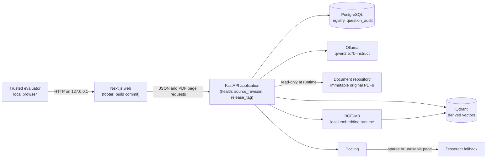

# DOST demonstration release — `demo-dost-v1.1`

**Status:** Milestone 13 demonstration package, current release
`demo-dost-v1.1` (`demo-dost-v1` is superseded — Section 6). This is a
scripted, honest walkthrough of a prototype, not a claim of production
readiness, legal authority, or accuracy guarantees. Read this alongside
[`docs/PILOT_PLAN.md`](PILOT_PLAN.md), [`docs/MVP_SPEC.md`](MVP_SPEC.md), and
[`docs/milestones/M12_STATUS.md`](milestones/M12_STATUS.md), which this
document does not restate or soften.

## 1. What `demo-dost-v1.1` is

A tagged Git commit and a pair of Docker images (`api`, `web`) built from it,
carrying their own commit and tag identity (Section 5) so a reviewer can
confirm exactly what ran. It packages Milestones 1–10 and 12 as they exist on
`main`, plus this milestone's release plumbing, plus a Milestone 13 follow-up
round that fixed a host-permission gap, an evaluation-runner lock-ordering
bug, and brought `CLAUDE.md` current (`v12.md`). It does not add any
answering, retrieval, or extraction behavior beyond what Milestone 12
already merged.

## 2. Seven-minute demonstration guide

Run from a freshly started stack (`docker compose up -d`, all five services
healthy) with answering enabled for the session (`make answering-on` —
`demo-dost-v1.3`; sets `KENDRA_ANSWERING_ENABLED=true` in `.env`, recreates
`api`, and waits for readiness) — Milestone 10 answering is off by default
and remains an unaccepted prototype (Section 4). Every question below is
asked against the nine-PDF, 50-case public BIR evaluation corpus already
staged in `document-repository/`; `collection_id` is the fixed value
`"default"`, matching what the gold-evaluation runner uses. Restore
`make answering-off` when the session ends.

### 0:00–0:45 — Show what's actually running, not asserted

```bash
curl -s http://127.0.0.1:8000/api/v1/health | python3 -m json.tool
```

Point out `source_revision` and `release_tag` in the response (Section 5) —
both are baked into the image at build time, not typed in by hand — and the
same commit in the web footer at the bottom of the UI. Either
`http://localhost:3000` or `http://127.0.0.1:3000` works, with no CORS
dependency: the browser always calls the api at the page's own origin,
proxied server-side by `apps/web/next.config.ts`'s rewrite
(`demo-dost-v1.3`; see Section 5).

### 0:45–2:15 — A supported, cited answer (single document)

Drawn from gold case **`KND-M5-DF-009`** — verified fully fact-complete under
labeled rendering in EXP-13 run `20260902T005308Z-35770ed8` (`exp13_summary.md`
Part 1: "Complete — 1/1").

```bash
curl -s -X POST http://127.0.0.1:8000/api/v1/questions \
  -H "Content-Type: application/json" \
  -d '{"question": "Within how many days from the EOPT Act'"'"'s effectivity were implementing rules and regulations to be promulgated, according to RMC No. 3-2024?", "collection_id": "default"}' \
  | python3 -m json.tool
```

Expected: `status: supported`, one claim ("ninety calendar days from the
effectivity of the Act"), one citation into `RMC_03_2024_EOPT_Act.pdf`, page
2. Open the citation's `source_url` to show the original page.

### 2:15–3:45 — A supported, cited answer (OCR-derived source)

Drawn from gold case **`KND-M5-DF-020`** — the other case verified fully
fact-complete in the same EXP-13 run (Part 1: "Complete — 2/2").

**Correction to the milestone brief that requested this demo:** both
`KND-M5-DF-009` and `KND-M5-DF-020` are single-document cases in
`evaluation/gold_cases.json` (one authoritative filename each), not
cross-document comparisons — checked directly against the dataset, not
assumed. They were the two cases in EXP-13's originally-abstained, six-case
set that came back `supported` *and* fully fact-complete under labeled
rendering; the other two newly-`supported` cases in that set
(`KND-M5-CD-005`, `KND-M5-DF-005`) are fact-incomplete and are scripted as
disclosed limitations instead (Section 4), not successes. No genuinely
cross-document case in the qualified set (`KND-M5-CD-004`) came back
`supported` at all — it still abstains (Section 4). This demo script follows
the milestone brief's explicit case-ID constraint; it does not follow its
"spanning two documents" description of those cases, which does not match
the dataset.

```bash
curl -s -X POST http://127.0.0.1:8000/api/v1/questions \
  -H "Content-Type: application/json" \
  -d '{"question": "When did the invoicing provisions of RR No. 7-2024 become effective according to RMC No. 77-2024?", "collection_id": "default"}' \
  | python3 -m json.tool
```

Expected: `status: supported`, one claim stating both required facts (April
27, 2024 effective date; fifteen days from the April 12, 2024 publication),
two citations into `RMC_77_2024_Invoicing_QA_OCR.pdf` page 11 — the 12-page
image-only OCR document, worth noting explicitly since OCR text is never
treated as authoritative and the excerpt should be checked against the
rendered page.

### 3:45–5:30 — Fail-closed abstention, with its audit record

Drawn from gold case **`KND-M5-UN-007`** (deliberately unsupported) — chosen
because it is not a currentness/"is this still in effect" question; the one
required deliberately-unanswerable demo question in this milestone must not
be, except as a disclosed limitation (Section 4, item 3).

```bash
curl -s -X POST http://127.0.0.1:8000/api/v1/questions \
  -H "Content-Type: application/json" \
  -d '{"question": "What exact email address should a taxpayer use to submit Annex C or Annex D reports?", "collection_id": "default"}' \
  | python3 -m json.tool
```

Expected: `status: insufficient_evidence`, answer text exactly `Insufficient
information in the uploaded documents.`, empty `claims`, empty `citations`.

Then show the audit record this abstention produced — the hash-chained,
append-only `question_audit` table, not a log line that could be edited:

```bash
docker compose exec postgres psql -U kendra -d kendra -c \
  "SELECT sequence, question, status, supported, record_hash, previous_record_hash
   FROM question_audit ORDER BY sequence DESC LIMIT 1;"
```

Point out `previous_record_hash` linking back to the prior row, and that no
`UPDATE`/`DELETE` path exists for this table (`apps/api/src/kendra_api/audit/
sink.py`) — this is what INC-001 (Section 4, item 9) relied on to reconstruct
what actually happened after two unnoticed duplicate runs.

### 5:30–7:00 — What this demo does not show, said out loud

Close by stating, not skipping, three things live in front of the reviewer:

1. `KND-M5-UN-002` — a question about whether an issuance is *currently in
   effect* — returns a confident, wrong `supported` answer, not an
   abstention. It is not demonstrated live in this script (per this
   milestone's own constraint); it is disclosed here as a known defect
   (Section 4, item 3).
2. Labeled evidence rendering, the reason the two supported answers above
   work at all, was adopted as the default despite failing its own
   preregistered success bar (Section 4, item 5).
3. Milestone 10 answering — everything just demonstrated — carries
   `acceptance_claim: false` on every evaluation report (Section 4, item 7).

## 3. Architecture

Unchanged from [`docs/ARCHITECTURE.md`](ARCHITECTURE.md) Section 4; reproduced
here for demo convenience with the release-identity additions from Section 5
of this document noted on `api` and `web`:



`Docling`, `Tesseract`, and `BGE-M3` run inside the `api` image, not as
separate services (`ARCHITECTURE.md` Section 4). Nothing in this milestone
changes a service boundary or trust boundary from `ARCHITECTURE.md` Section 8
or `THREAT_MODEL.md` Section 3.

## 4. Honest limitations

1. **Release evaluation accuracy (this milestone's own gold rerun):**
   see Section 6 for the run-id and the measured figure, filled in after that
   run completes. History: `0.72` classification accuracy at the M12 baseline
   (`evaluation/runs/M12-gold/20260831T125331Z-0bcc9dd7/report.json`, unlabeled
   rendering) → `0.82` under labeled rendering in EXP-13's live non-regression
   run (`evaluation/runs/EXP-13/nonregression/20260902T005308Z-35770ed8/report.json`).
   Both figures are on the 50-case `kendra-bir-public-gold-v2` set, whose
   `dataset_status` is `initial_expert_review_required` — not an
   expert-adjudicated benchmark.
2. **Atomic-fact recall is provisional and unscored by a human reviewer.**
   Every run report's `atomic_fact_scoring.status` is `"provisional"` — string
   matching against `expected_answer_facts`, not human judgment
   (`docs/EVALUATION_METHOD.md`'s atomic-fact scoring requires the latter
   before any figure governs a decision).
3. **`KND-M5-UN-002` temporal-boundary defect.** Asked whether RR No. 7-2024
   is still the controlling invoicing regulation as of August 15, 2026, the
   system returns a confident `supported` answer instead of abstaining, from
   a corpus bounded to 2024 documents. Recorded in
   `evaluation/M12_FINDINGS.md` part (a); persists unchanged under both
   rendering modes (`ADR-012` Section 4).
4. **EXP-11's result stands.** A larger same-family model
   (`qwen2.5:14b-instruct`, `B1_LARGER`) did not resolve the six originally
   abstaining cases (answered only 2 of 6) and regressed three previously
   correct cases (`KND-M5-CD-003`, `KND-M5-CD-008`, `KND-M5-LT-009`) on the
   live non-regression set (`evaluation/runs/EXP-11/stage1-20260901T120327Z-221e1bcd/stage1_summary.md`).
   Model size is not adopted as a fix for anything in this release.
5. **Labeled evidence rendering was adopted against its own preregistered
   bar.** EXP-13's frozen decision rule (`docs/experiment-decisions/
   EXP-13-preregistration.md` Section 8) required answering at least 5 of 6
   qualified cases; the run answered 2 of 6. `docs/adr/
   012-labeled-evidence-rendering-default.md` adopts `labeled` as the default
   anyway, on separate net-benefit grounds (accuracy `0.72`→`0.82`, zero
   regressions, zero label leaks) — and states plainly, in its own Section 3,
   that the frozen verdict is not overturned by that adoption. This release
   runs with the adopted default; the frozen experiment's own verdict was
   still "not supported."
6. **Fact-incompleteness defect class.** The system can return a `supported`,
   correctly cited answer that omits a required fact. Two confirmed
   instances, both introduced by labeled rendering: `KND-M5-CD-005` (omits
   the Section 264(a) Tax Code citation fact) and `KND-M5-DF-005` (omits the
   "updating required only when non-fee registration information changes"
   fact) — both 2 of 3 required facts present. `ADR-012` Section 4 states
   plainly that fact completeness is not machine-enforced anywhere in the
   verification contract; only downstream human review catches this pattern.
7. **Milestone 10 is open.** `acceptance_claim: false` on every evaluation
   report this milestone produces, same as every report before it
   (`docs/milestones/M12_STATUS.md`).
8. **Model output nondeterminism observed at temperature 0 with a fixed
   seed.** `ANSWER_NUM_CTX`, `temperature: 0`, and `seed: 0` are all fixed
   (`apps/api/src/kendra_api/answering/model_client.py`), but temperature 0
   alone does not guarantee bit-identical generation run to run
   (`evaluation/M12_FINDINGS.md` part (f)); a fixed seed narrows this, it
   does not eliminate it.
9. **Milestone 11 (OCR quality/render-resolution work) is defined but
   unimplemented.** `ADR-011` is `Proposed`, not `Accepted`, and lives on
   `prototype/milestone-10-verification-contract`, not on `main`. It does not
   block this release; it is roadmap, not a current capability. See Section
   7.
10. **INC-001** (`docs/incidents/INC-001-ghost-evaluation-runs.md`) — two
    unnoticed duplicate evaluation runs wrote 100 real rows into
    `question_audit` in 2026-09-01. Those rows are retained, not deleted —
    the append-only audit design has no `UPDATE`/`DELETE` path by
    construction, and the incident is itself the demonstration that an
    audit trail without deletion is what let the duplication be discovered
    and explained after the fact, rather than silently going unnoticed.

**This system is not production-ready, not legally authoritative, not
hallucination-free, and does not guarantee accuracy.** Every claim above is
sourced to a specific run, report, or document cited inline; none is a
summary judgment offered without evidence.

## 5. Source revision, release tag, and how they are supplied

Both are supplied dynamically, never hand-typed into a committed file:

- **api image:** `apps/api/Dockerfile`'s `runtime` stage takes
  `ARG KENDRA_SOURCE_REVISION=""` and `ARG KENDRA_RELEASE_TAG=""`, each
  baked to a matching `ENV`. `docker-compose.yml`'s `api.build.args` supplies
  both from the host environment (`${KENDRA_SOURCE_REVISION:-}` /
  `${KENDRA_RELEASE_TAG:-}`); `apps/api/src/kendra_api/health.py` exposes
  both as `source_revision` and `release_tag` in `/api/v1/health`.
- **web image:** `apps/web/Dockerfile`'s `build` stage takes
  `ARG NEXT_PUBLIC_KENDRA_GIT_COMMIT=""`, inlined into the client bundle by
  Next.js at `npm run build` time; `apps/web/src/app/layout.tsx` renders
  it in a page footer via `apps/web/src/lib/config.ts`'s `gitCommit()`.
  The web heading shows the same information — `release_tag` from
  `/api/v1/health`, the availability banner's own fetch reused, not a
  second one — falling back to just "Kendra" when `release_tag` is empty
  (`demo-dost-v1.3`; an untagged build, or a commit before the api's own
  build args were supplied, both show the fallback).
- **The browser never needs the api's host** (`demo-dost-v1.3`,
  fixing a bug found while rehearsing the demo: `http://localhost:3000`
  worked for the footer but the availability banner showed "API
  unavailable", because the browser called the api directly at the
  build-time-baked `NEXT_PUBLIC_KENDRA_API_BASE_URL` — a cross-origin call
  from the `localhost` page origin that the api's CORS policy rejects).
  `NEXT_PUBLIC_KENDRA_API_BASE_URL` is now empty by default
  (`ARG NEXT_PUBLIC_KENDRA_API_BASE_URL=""` in `apps/web/Dockerfile`,
  `${NEXT_PUBLIC_KENDRA_API_BASE_URL:-}` in `docker-compose.yml`), so
  `apps/web/src/lib/config.ts`'s `healthEndpoint()` resolves to a relative
  path and every browser fetch lands on the page's own origin. A Next.js
  server-side rewrite (`apps/web/next.config.ts`'s `rewrites()`, `/api/:path*`
  → `http://${KENDRA_API_INTERNAL_HOST:-api}:${KENDRA_API_INTERNAL_PORT:-8000}/api/:path*`,
  both read from the container's environment at server start, not baked in)
  then proxies that request to the api container over the compose network.
  Both `http://localhost:3000` and `http://127.0.0.1:3000` work identically,
  with no CORS dependency either way. An operator can still set
  `NEXT_PUBLIC_KENDRA_API_BASE_URL` to an absolute URL to override this and
  have the browser call the api directly.
- **`make build`** (`Makefile`) computes all three from `git` at build time —
  `git rev-parse HEAD` for the two commit variables, `git describe --tags
  --exact-match HEAD` (empty, harmlessly, on an untagged commit) for the
  release tag — and passes them to `docker compose build api web`. Nothing
  is hard-coded in a Dockerfile, compose file, or source file.

## 6. Release gold evaluation

**`demo-dost-v1.3` is current; `v1`, `v1.1`, and `v1.2` are superseded.** `v1`
(commit `903b1089`) predates the `docker-compose.yml` `ingest`-service
environment-passthrough fix (commit `4b09600`) and cannot be deployed from
scratch as tagged — see Milestone 13's `v11.md` report Section 6 for the
two bugs that fix addresses. `v1.1` (Section 6.2 below) fixed the two bugs `v1`'s drill found, but a
from-tag drill against the pushed `v1.1` tag itself (Section 10, "Recovery
drill against `demo-dost-v1.1`") found a third, different bug in the same
family: the ownership-fix command itself fails on a genuinely fresh
`document-repository/`, because it names three subdirectories that do not
exist yet on a directory that has never been ingested into. **`v1.1`, as
tagged and pushed, is therefore also not from-scratch deployable without a
manual step** — the same disease as `v1`, a different organ. A corrected
instruction is committed on the branch after the tag, but per the standing
rule against re-pointing a pushed tag, it cannot retroactively make `v1.1`
itself pass; only a future release's own from-tag drill can confirm that.
`v1.2` (Section 6.3 below) closed this pattern: the first tag drilled
from a fresh origin clone, top to bottom, per Section 10 exactly as written,
*before* being tagged — the from-scratch deployability question settled
at tag time rather than discovered afterward by a subsequent drill. **`v1.2`
is itself superseded by `v1.3` (Section 6.4 below) for the demonstration
script specifically** — not because deployability or answering regressed
(both are unchanged, and `v1.2` remains valid as tagged for both), but
because rehearsing the demo on 2026-09-03 found the UI unusable from the
`localhost` origin (CORS), the heading reading a stale "Milestone 8," and
the answering toggle and offline-verification procedure undocumented or
outright broken (an `.env` `sed` silently no-op'ing). `v1.3` fixes all
four; it changes no answering, retrieval, ingestion, or evaluation code.
Use `v1.3` for any new demonstration; `v1`, `v1.1`, and `v1.2` remain
tagged and unaltered as the historical record they always were.

**Supersession summary:** `v1` (predates the compose `ingest`-service
environment-passthrough fix); `v1.1` (the README ownership instruction
fails on a genuinely fresh `document-repository/`; `ollama-model-loader`
never staged the answer model; the extraction-policy template carried the
pre-`ADR-007` value); `v1.2` (all three fixed; drilled from a fresh origin
clone at RC *before* tagging — first tag with from-scratch deployability
confirmed as tagged **and** the first whose evaluation reproducibility is
gated by a preregistered criterion, `ADR-014`'s `N = 47` per-case agreement
with full per-case disclosure of every differing case, rather than an
informal exact-match requirement discovered to be unachievable only after
a drill failed it; but the demo UI failed from the `localhost` origin, the
heading read "Milestone 8," and the answering toggle and offline procedure
were undocumented or wrong); `v1.3` (those four fixed; same-origin web
rewrite, product-name-and-tag heading, `make answering-on`/`-off`,
documented offline-verification procedure and script; deployability and
answering unchanged from `v1.2`, drilled and gated under `ADR-014` again
rather than assumed carried over).

### 6.1 — `demo-dost-v1` (superseded)

Run against release-candidate commit `903b10895d543bad337cabab97e7e1d8d1ea4690`
(the commit `demo-dost-v1` tags), using the hardened runner
(`kendra_api.evaluation.run`) — named container `kendra-eval-m13-release`, no
`--rm`, default lock path (`evaluation/runs/.lock`), default revision-match
preflight, no `--allow-revision-mismatch`. Not a reuse of the 2026-08-31 M12
runs or any EXP-11 run.

- **Run directory:** `evaluation/runs/M13-release/20260902T022843Z-903b1089/`
  (`evaluation_run_id eval-f0f2fc29-c398-4773-b52e-a4fb7f27a99b`) — preserved
  locally, ignored by Git (`/evaluation/runs/*` in `.gitignore`).
- **`report.json`'s `source_revision`:** `903b10895d543bad337cabab97e7e1d8d1ea4690`
  — matches the tagged commit exactly; `source_revision_mismatch_overridden:
  false` in `run_config.json`.
- **Classification accuracy: `0.82`** (`TP 32 / FN 8 / FP 1 / TN 9`) — the
  single false positive is `KND-M5-UN-002`, the already-disclosed temporal-
  boundary defect (Section 4, item 3), not a new failure.
- **Unsupported false-answer rate: `0.1`** (1 of 10).
- **`question_audit`: 300 before, 350 after — a clean `+50`**, confirmed by
  direct `SELECT count(*)`, with this run's own 50 rows individually
  confirmed by `evaluation_run_id`.
- **Hash chain: `PASS: 350 records, chain verified from genesis`**
  (`scripts/verify_audit_chain.py`), run immediately after.
- All three demo-script cases (Section 2) matched their scripted outcome
  exactly in this run.
- This run's own release-eval attempt needed one retry, mid-run, at the git
  revision preflight (`safe.directory`) — see `v11.md` Section 4. That gap
  is what Task 2 of the Milestone 13 follow-up round fixed; `v1.1`'s own run
  (Section 6.2) needed none.

### 6.2 — `demo-dost-v1.1` (superseded)

Rerun against release-candidate commit
`6a671dee7df6d8fb263deb4a372f87c91d71816f` (the commit `demo-dost-v1.1`
tags), using the hardened runner with Task 1–2's fixes already in place —
named container `kendra-eval-m13-1-release`, no `--rm`, default lock path,
default revision-match preflight, no `--allow-revision-mismatch`. Not a
reuse of `v1`'s run, the 2026-08-31 M12 runs, or any EXP-11 run.

- **Run directory:** `evaluation/runs/M13.1-release/20260902T044009Z-6a671dee/`
  (`evaluation_run_id eval-f8338dde-fa4f-4b78-b760-a219bf13690e`) — preserved
  locally, ignored by Git.
- **`report.json`'s `source_revision`:** `6a671dee7df6d8fb263deb4a372f87c91d71816f`
  — matches the tagged commit exactly; `source_revision_mismatch_overridden:
  false`.
- **Zero retries needed** — the runner passed its git-revision preflight on
  the first attempt, confirming Task 2's fix.
- **Classification accuracy: `0.82`** (`TP 32 / FN 8 / FP 1 / TN 9`) —
  identical confusion matrix to `v1`'s run; the sole false positive is again
  `KND-M5-UN-002`. Expected: nothing between the two releases changed
  answering behavior (permissions, lock ordering, docs, `CLAUDE.md`).
- **Unsupported false-answer rate: `0.1`** (1 of 10) — unchanged.
- **`question_audit`: 350 before, 400 after — a clean `+50`**, confirmed by
  direct `SELECT count(*)` and by this run's `evaluation_run_id` count.
- **Hash chain: `PASS: 400 records, chain verified from genesis`.**
- All three demo-script cases matched their scripted outcome exactly:
  `KND-M5-DF-009` (`supported`, 1 citation), `KND-M5-DF-020` (`supported`,
  2 citations), `KND-M5-UN-007` (`insufficient_evidence`, 0 citations).
- **From-scratch deployability: refuted, as tagged.** The from-tag drill
  (Section 10, "Recovery drill against `demo-dost-v1.1`") found the
  ownership-fix command itself fails on a genuinely fresh
  `document-repository/`. A manual `mkdir -p` step was needed — see that
  section for the exact finding and the corrected instruction, which
  post-dates this tag and does not retroactively change this result.

### 6.3 — `demo-dost-v1.2` (superseded)

The first release drilled from a fresh origin clone, top to bottom, per
Section 10 exactly as written, **before** being tagged — Milestone 13
round 7's rule 13 required every command run to be one already in this
document; any gap would have stopped the drill rather than being patched
mid-run. Gated under `ADR-014` (Accepted, `N = 47`), which replaced the
prior rounds' informal exact-confusion-matrix requirement after it proved
not reliably achievable across independently built vector indexes
(`ADR-014` Section 1).

**Deployment gate (`ADR-014`, exact) — PASS on every element:**

| Element | Required | Observed | Result |
|---|---|---|---|
| `source_revision` at drill health == RC | `b8286729…` | `b8286729…` | PASS |
| `make check-template` in fresh clone | pass | pass (5/5 checks) | PASS |
| Both models present | `bge-m3`, `qwen2.5:7b-instruct` | both present | PASS |
| 9/9 documents `ready`, chunk/page counts == release | 34/4, 5/2, 35/12, 3/1, 2/1, 3/1, 2/1, 12/3, 286/16 | identical, all nine | PASS |
| `pipeline_revision` == RC, all nine | `b8286729…` | `b8286729…`, all nine | PASS |
| `report.json` `source_revision_mismatch_overridden` | `false` | `false` | PASS |
| Drill chain verify | `PASS` at 50 | `PASS: 50 records, chain verified from genesis` | PASS |
| Zero residual drill resources | none | none (4 checks, all empty) | PASS |
| Scratch clone removed | gone | gone | PASS |

**Release-eval gate (fixed index, exact) — PASS.** `kendra-eval-m13-6-release`
(`evaluation_run_id eval-b77fbf23-17de-42fb-8826-15bc78b79ee5`,
`evaluation/runs/M13.6-release/20260902T121848Z-b8286729/`) reproduced
`M13.1-release` exactly: `0.82` (`TP 32/FN 8/FP 1/TN 9`), sole FP
`KND-M5-UN-002`, unsupported false-answer rate `0.1`, zero runner failures.
`question_audit`: `500` before, `550` after. Hash chain: `PASS: 550 records,
chain verified from genesis`. All three demo-script cases (Section 2)
matched their scripted outcome exactly: `KND-M5-DF-009` (`supported`, 1
citation), `KND-M5-DF-020` (`supported`, 2 citations), `KND-M5-UN-007`
(`insufficient_evidence`, 0 citations).

**Evaluation gate (`ADR-014`, `N = 47`) — PASS.** `kendra-eval-m13-6-drill`
(`evaluation_run_id eval-3aacaff8-2534-478a-a8fa-f64481573be0`,
`evaluation/runs/M13.6-recovery-drill/20260902T121128Z-b8286729/`) agreed
with the release evaluation on **48 of 50 cases**:

| Case | `expected_result` | Release label | Drill label |
|---|---|---|---|
| `KND-M5-CD-004` | `supported` | `unsupported` | `supported` |
| `KND-M5-DF-018` | `supported` | `supported` | `unsupported` |

Sole false positive `KND-M5-UN-002` unchanged in both. Unsupported
false-answer rate unchanged (`0.1` in both). Both differing cases were
already-disclosed borderline categories (`cross_document_comparison`,
`direct_factual` under OCR extraction) — neither is a new failure mode.

**Cross-round observation (two data points, stated as such, not a trend):**
this is the second index-rebuild drill on record. Round 5's fresh-index
drill (`M13.4-recovery-drill`) differed from its release evaluation on
`KND-M5-CD-004`, `KND-M5-DF-005`, and `KND-M5-DF-018` (47/50); this round's
(`M13.6-recovery-drill`) differed on `KND-M5-CD-004` and `KND-M5-DF-018`
(48/50) — `DF-005` was stable this time. `CD-004` and `DF-018` have now
moved on *both* independently built indexes; `DF-005` moved on only one.
`DF-018`'s evidence chunk is OCR-extracted (`RMC_77_2024_Invoicing_QA_OCR.pdf`,
`extraction_method: tesseract`), confirmed directly against this round's own
`cases.jsonl`, not inherited from an earlier run. Two data points cannot
establish whether `CD-004`/`DF-018` are structurally more index-sensitive
than other cases or this is coincidence — explaining *why* is exactly what
`PILOT_PLAN.md` item 4's retrieval probe (per-case retrieved chunk IDs and
scores) is for; today the mechanism can only be inferred, not shown.

**Wall-clock table** (marker-measured for stages 2–5; stage 1 inferred from
container status text, "Up N seconds," rather than an explicit epoch marker;
stages 6–9 completed within a few seconds each, consistent with prior
rounds' measurements of the same steps, but not individually re-measured
this round):

| Stage | Wall time | Note |
|---|---:|---|
| 1. Bring up postgres/qdrant/ollama | ~6s | inferred from `docker compose ps` status text |
| 2. Docling + Ollama loaders (parallel) | 953s | marker-measured |
| 3. Ingest all 9 documents | 201s | marker-measured |
| 4. Build + bring up api/web | 84s | marker-measured — no port collision this round (ports pre-specified per round 6's fix) |
| 5. Answering toggle + gold evaluation (50 cases) | 136s | marker-measured (start command to `report.json` write) |
| 6. Chain verify | a few seconds | not individually re-measured |
| 7. Preserve run artifacts (`rsync`) + 8. Teardown + 9. Scratch clone removal | a few seconds each | not individually re-measured |
| **Total, empty to torn down** | **≈24 minutes** | sum of measured/inferred rows above |

### 6.4 — `demo-dost-v1.3` (current)

Web/procedure hardening round: same-origin browser↔api rewrite (no CORS
dependency), a heading that shows the product name and release tag instead
of a stale "Milestone 8," `make answering-on`/`answering-off` (replacing a
manual `sed` that silently no-op'd when the key was absent from `.env`),
and a documented offline-verification procedure and script. **No change to
answering, retrieval, ingestion, or evaluation code** — this round
re-confirms deployability and evaluation reproducibility under `ADR-014`
rather than assuming they carry over unchanged from `v1.2`.

**Commit discrepancy, disclosed rather than hidden:** the drill and release
evaluation below both ran at `2f7b0d0`, one commit before the tagged
`003b062`. Mid-drill, Step 6 (`docker compose build api web`) failed —
DNS resolution inside the build sandbox was broken (see "Host networking
note" below) — and while diagnosing it, the drill's own Step 7
(`make answering-on`) surfaced a real bug in that commit's Makefile: a
`.env` with `KENDRA_API_PORT` defined twice (the template's `8000` plus the
drill's own appended `8001` override, per Section 10 step 0) made
`grep | cut` return both lines newline-joined, corrupting the health-check
URL. Both were fixed and pushed as their own commits (`2f7b0d0`'s DNS
workaround needed no code change; the Makefile fix is `2f7b0d0`'s parent →
child). A third, unrelated gap surfaced afterward: the heading fix's
client-only implementation never put the release tag in the raw
server-rendered HTML, failing this section's own plain-`curl` verification
below — fixed in `003b062`, the final tag. Since that fix touches only
`apps/web` frontend rendering — no ingestion, answering, retrieval, or
evaluation code — the drill and release-eval evidence below remains valid
for the tagged commit; this is independently confirmed by an unchanged
backend test count at `003b062` (`make test`/`make test-full`,
`121/2/43`/`142/0/43`) and a direct, real-tag `curl` check against the
rebuilt main stack (Task 8 below), stronger evidence for that specific
behavior than an untagged drill could ever provide (the drill's own
`release_tag` is always empty).

One further consequence: the 9 documents ingested during the drill were
stamped `pipeline_revision = d6eb782` — the commit that was `HEAD` at
ingestion time, one commit *before* `2f7b0d0` (the drill's own eval
`source_revision`, after the DNS/Makefile fixes and a required image
rebuild) and two before the final tag. Ingestion behavior itself is
unaffected (no code in `apps/api` changed across any of these three
commits), but the recorded provenance label undershoots RC by two commits —
disclosed here rather than left implicit, consistent with this document's
practice of never asserting a mechanical field represents more than what
was actually recorded (Milestone 13 round 6's `'unversioned'` note, Section
8, is the same principle).

**Host networking note (this workstation only, not a repository change):**
Docker's build sandbox (the classic `docker` buildx driver's default
network) had broken DNS — traced to residual damage from `nmcli networking
off` earlier the same day (Section 8's warning box) that a
`docker compose down && up` had already fixed for the compose-managed
networks but not Docker's own default `bridge`. Worked around for this
session only by creating a `docker-container` buildx builder attached to a
fresh user-defined network (`docker network create`, `docker buildx create
--driver docker-container --driver-opt network=<name>`); this is host
state, not anything committed to this repository, and does not affect a
workstation without this specific residual damage.

**Deployment gate (`ADR-014`, exact):**

| Element | Required | Observed | Result |
|---|---|---|---|
| `source_revision` at drill health == drill's own eval commit | `2f7b0d0…` | `2f7b0d0…` (after the mid-drill rebuild) | PASS |
| Same-origin proxy through drill web (`127.0.0.1:3001/api/v1/health`) | `status: ready` | `status: ready` | PASS |
| Heading via drill web (`127.0.0.1:3001`, untagged) | `Kendra` | `Kendra` (×3 in grep) | PASS |
| `make check-template` in fresh clone | pass | pass (5/5 checks) | PASS |
| Both models present | `bge-m3`, `qwen2.5:7b-instruct` | both present | PASS |
| 9/9 documents `ready`, chunk/page counts == release | 34/4, 5/2, 35/12, 3/1, 2/1, 3/1, 2/1, 12/3, 286/16 | identical, all nine | PASS |
| `pipeline_revision` == RC, all nine | `003b062…` | `d6eb782…` (see commit-discrepancy note above) | **caveated — see note, not blocking** |
| `report.json` `source_revision_mismatch_overridden` | `false` | `false` | PASS |
| Drill chain verify | `PASS` at 50 | `PASS: 50 records, chain verified from genesis` | PASS |
| Zero residual drill resources | none | none (containers, volumes, buildx builder/network, scratch clone all removed) | PASS |
| Scratch clone removed | gone | gone | PASS |

**Release-eval gate (fixed index, exact) — PASS.** `kendra-eval-m13-7-release`
(`evaluation_run_id eval-78455148-6877-4822-81f2-993d2e091498`,
`evaluation/runs/M13.7-release/20260903T143031Z-2f7b0d05/`) reproduced
`M13.6-release` exactly: `0.82` (`TP 32/FN 8/FP 1/TN 9`), identical 8-case
misclassified list, sole FP `KND-M5-UN-002`, unsupported false-answer rate
`0.1`, zero runner failures. `question_audit`: `556` before, `606` after
(exactly +50). Hash chain: `PASS: 606 records, chain verified from
genesis`. All three demo-script cases (Section 2), evaluated as part of
this same 50-case run, matched their scripted outcome exactly:
`KND-M5-DF-009` (`supported`, 1 citation), `KND-M5-DF-020` (`supported`, 2
citations), `KND-M5-UN-007` (`insufficient_evidence`, 0 citations).

**Evaluation gate (`ADR-014`, `N = 47`) — PASS.** `kendra-eval-m13-7-drill`
(`evaluation_run_id eval-de0e4346-3492-4841-88bf-179c99b3c167`,
`evaluation/runs/M13.7-recovery-drill/20260903T142135Z-2f7b0d05/`) agreed
with the release evaluation on **48 of 50 cases**:

| Case | `expected_result` | Release label | Drill label |
|---|---|---|---|
| `KND-M5-CD-004` | `supported` | `unsupported` | `supported` |
| `KND-M5-DF-018` | `supported` | `supported` | `unsupported` |

Sole false positive `KND-M5-UN-002` unchanged in both. Unsupported
false-answer rate unchanged (`0.1` in both). Both differing cases are the
same two, in the same direction, as `M13.6-recovery-drill` vs.
`M13.6-release` — the third data point in the cross-round observation
below.

**Cross-round observation (three data points, stated as such, not a
trend):** this is the third index-rebuild drill on record. Round 5's
(`M13.4-recovery-drill`) differed from its release evaluation on
`KND-M5-CD-004`, `KND-M5-DF-005`, and `KND-M5-DF-018` (47/50); round 7's
(`M13.6-recovery-drill`) and this round's (`M13.7-recovery-drill`) both
differed only on `KND-M5-CD-004` and `KND-M5-DF-018` (48/50 each) — the
same two cases, same direction, on two independently rebuilt indexes in a
row. `DF-005` has now been stable across the last two rebuilds. Three data
points still cannot establish whether `CD-004`/`DF-018` are structurally
more index-sensitive than other cases, but the repetition across
independent rebuilds makes coincidence less likely than it was after round
7 alone — `PILOT_PLAN.md` item 4's retrieval probe remains the way to
actually explain it, not infer it.

**Wall-clock:** not cleanly comparable to prior rounds' measurements this
time — the mid-drill DNS diagnosis, buildx-builder workaround, Makefile fix,
and required image rebuild (documented above) extended Stage 4 well beyond
its steady-state time and were not the kind of thing worth marker-timing
precisely mid-troubleshoot. Total elapsed, empty stack to torn down,
including that detour: **≈70 minutes**; a clean re-run without the detour
would be expected to land close to `v1.2`'s ≈24 minutes, since no
ingestion- or evaluation-relevant code changed.

## 7. Hardware requirements

`docs/ARCHITECTURE.md` Section 11 states these as **planning assumptions, not
verified requirements** — no formal capacity/load testing has been run, and
this section does not change that status. Reference values:

| Resource | Planning baseline (`ARCHITECTURE.md`) | Measured on this session's dev workstation |
|---|---|---|
| GPU | ~12 GB usable VRAM for a quantized 7B/8B Qwen model (CPU-only functionally possible, likely too slow) | NVIDIA RTX 5070 Ti, 16 GB VRAM |
| System RAM | 32 GB practical baseline | 89 GB |
| Disk | ≥100 GB free SSD (images, model weights, PostgreSQL, Qdrant, originals, extraction workspace, ≥1 staging index generation) | 1.8 TB volume, 111 GB used at time of writing |
| CPU | Not specified; Docling/Tesseract are CPU/memory/temp-disk intensive, ingestion serialized | 32 logical cores |

A deployment materially below the planning baseline (in particular, no GPU
with ~12 GB+ VRAM available to Ollama) has not been tested and should not be
assumed to work at usable latency.

## 8. Deployment requirements

- Docker Engine with the Compose plugin (`docker --version`, `docker compose
  version`); no host Python/Node/PostgreSQL/Qdrant/Ollama install (`README.md`
  "Prerequisites").
- Loopback-only ports (`KENDRA_API_BIND_HOST`/`KENDRA_WEB_BIND_HOST` both
  `127.0.0.1` by default) — this MVP has no authentication
  (`ARCHITECTURE.md` Section 2) and must not be exposed beyond one physically
  controlled workstation and one trusted evaluator.
- `KENDRA_POSTGRES_PASSWORD` set to a real value in `.env` (never committed);
  every other `KENDRA_*` variable has a disposable local default in
  `.env.example`.
- The approved public BIR evaluation corpus staged under
  `document-repository/` (already admitted for this demo) and, for a
  from-scratch rebuild, the corresponding manifests and PDFs staged under
  `intake/` (Section 9).
- Docling layout/table models and the `bge-m3`/`qwen2.5:7b-instruct` Ollama
  models pre-staged while network access is available (`docker compose
  --profile ingestion-setup run --rm docling-model-loader` /
  `ollama-model-loader`) — the deployment can then run fully offline
  (`ARCHITECTURE.md` Section 3), though offline operation itself remains
  `EXP-07`-gated per that document, not independently re-verified by this
  milestone. **This bullet is true of `ollama-model-loader` as of the
  `demo-dost-v1.2` round; before that fix, the loader pulled only the
  embedding model (`bge-m3`) — the answer model was never staged by any
  documented procedure, a gap the `v1.2` from-scratch drill caught before
  tagging (Section 10's `v1.1` stage-2 footnote).**
- No real agency, confidential, personal, or mixed-permission document may
  be loaded (`README.md` "Safety boundary").
- **The demo stack's Ollama volume must contain only the two documented
  models** (`bge-m3`, `qwen2.5:7b-instruct`); any additional model present is
  to be recorded in the report of the round that finds it, not silently
  removed or ignored. Precedent: `qwen2.5:14b-instruct` (9.0 GB) has been
  present on the main dev stack's `kendra_ollama_data` volume since `EXP-11`'s
  Stage 1 (`B1_LARGER` arm, `evaluation/runs/EXP-11/stage1-20260901T120327Z-221e1bcd/`,
  2026-09-01) — a fully accounted-for experiment, not an unexplained
  addition, simply never cleaned up from the shared, persistent volume
  afterward (Milestone 13 round 5, `v16.md` Task 2).
- **The demonstration stack's own index is not fully provenance-stamped.**
  Its nine indexed documents' `processing_runs` rows all carry
  `pipeline_revision = 'unversioned'` — a literal `Settings` class default
  from Milestone 9 (`3ce70b6`), removed when Milestone 12 (`4f57903`)
  introduced real revision stamping via `resolve_source_revision()`. These
  nine documents were ingested before that change and have simply never been
  re-ingested since; current code cannot itself produce `'unversioned'`
  (Milestone 13 round 6, `v17.md` Task 2e). `extractor_identity` is recorded
  for all nine and does state the extraction policy and tool versions used
  (`policy=native-primary-detection-v1;detector=docling-2.117.0;…`), but the
  **code commit** that built this index cannot be named — only the policy
  name and tool versions, not a `git` SHA. An evaluator who specifically
  wants a fully provenance-stamped index — every row's `pipeline_revision`
  equal to a real, checkable commit — should be shown a fresh deployment
  instead of this long-lived one; Section 10's from-scratch procedure
  produces exactly that in about 35 minutes, and its ingest step (fixed
  round 6) now stamps every row with the deploying commit rather than
  `"unknown"`.
- **Operator-reported, not a run this session performed:** two online
  passes of the three demo-script questions, run from the operator's own
  terminal on 2026-09-03 ahead of this round, returned `supported` /
  `supported` / `insufficient_evidence` and advanced `question_audit`
  550 → 553 → 556.

### Offline verification procedure

`demo-dost-v1.3`. Confirms answering behaves identically with the network
uplink disconnected — required because this MVP is meant to run fully
offline (`ARCHITECTURE.md` Section 3) — by diffing an "online" pass of the
three demo-script questions against an "offline" pass of the same three.

```bash
make answering-on
scripts/offline_check.sh online

# Identify the uplink, then disconnect it -- NOT `nmcli networking off`,
# see the warning below.
nmcli device status
nmcli device disconnect <uplink>          # or physically unplug the cable

ping -c 2 1.1.1.1                         # must fail
curl 127.0.0.1:8000/api/v1/health         # must still succeed (loopback only)

# Hard-refresh http://localhost:3000 -- page loads fully, no CORS/DNS
# dependency (demo-dost-v1.3, Section 5) -- and ask one question through the UI.

scripts/offline_check.sh offline
scripts/offline_check.sh diff <YYYYMMDD>  # date the online pass ran under

nmcli device connect <uplink>
make answering-off
```

Expected: the same three statuses in both phases, three `identical` lines
from the `diff` invocation, and `question_audit` grown by exactly the
number of questions actually asked (three from the script per phase, plus
one from the UI question above).

> **Do not use `nmcli networking off` to go offline.** Observed on this
> host, 2026-09-03: it took down Docker's own bridge interfaces —
> `docker0` and a project bridge (`br-*`) both went `NO-CARRIER` — and both
> of the stack's published ports returned `ERR_EMPTY_RESPONSE` /
> connection failures from the host, even though every container stayed
> `healthy` inside Docker. That is a false offline-failure signal, not a
> true test of the deployment's own offline capability. Disconnect the
> uplink device itself (`nmcli device disconnect <uplink>`) or unplug the
> cable instead — this leaves Docker's bridges alone and only removes the
> host's path to the internet.
>
> **Optional host hardening** (an operator's own sudo change to this
> workstation, not something this repository does): tell NetworkManager to
> never manage Docker's interfaces, so a future `nmcli networking off`
> cannot repeat this failure mode either.
>
> ```ini
> # /etc/NetworkManager/conf.d/99-docker-unmanaged.conf
> [keyfile]
> unmanaged-devices=interface-name:docker0;interface-name:br-*;interface-name:veth*
> ```
>
> ```bash
> sudo systemctl reload NetworkManager
> ```

**Result:** `[to be recorded by the operator after running the procedure on a tagged build; not run as part of this round]`

## 9. Pilot success metrics

See [`docs/PILOT_PLAN.md`](PILOT_PLAN.md) — success is defined there on
unsupported false-answer rate, misclassified-case count by category, and
audit-chain verification, deliberately not on headline classification
accuracy alone.

## 10. Recovery plan

If a dependency fails mid-demonstration, the required safe behavior is the
one `docs/ARCHITECTURE.md` Section 10 and `docs/DATA_GOVERNANCE.md` Section 9
already specify — fail closed, never substitute an unverified result. This
milestone adds nothing to that policy; it restates the specific commands for
a live demo session and validates one clean end-to-end recovery path.

| Failure during the demo | Immediate visible symptom | Safe behavior (already required) | Recovery command |
|---|---|---|---|
| **Ollama / model** unreachable or slow | `/api/v1/health`'s `ollama` service reports `not_ready`; questions return `system_error` | No generated prose is exposed; the API does not fall back to un-grounded model memory | `docker compose restart ollama`; wait for `docker compose ps` to show `healthy`; re-ask the question |
| **PostgreSQL** unavailable | `/api/v1/health`'s `postgres` service reports `not_ready`; no question can be answered or audited | Refuse results whose identity/audit state cannot be verified — never answer without an audit write | `docker compose restart postgres`; wait for `healthy`; re-verify with `docker compose exec postgres psql -U kendra -d kendra -c "SELECT 1;"` |
| **Qdrant** unavailable or a generation is stale | `/api/v1/health`'s `qdrant` service reports `not_ready`, or retrieval returns no candidates for a known-answerable question | No grounded answer; never fall back to cached excerpts | `docker compose restart qdrant`; if the generation itself is suspect, re-run ingestion (Section 9's from-scratch commands) rather than trusting a partial index |
| **OCR (Tesseract, via Docling)** fails on the 12-page scanned document | Ingestion for `RMC_77_2024_Invoicing_QA_OCR.pdf` reports a page `unextractable`; the two OCR-sourced demo questions in Section 2 have no citation to offer | Mark the page's terminal state explicitly; never substitute empty or fabricated text as a successful extraction | Re-run ingestion for that one document (`docker compose --profile ingestion run --rm ingest RMC_77_2024_Invoicing_QA_OCR.pdf --manifest RMC_77_2024_Invoicing_QA_OCR.manifest.json`); if it keeps failing, drop that document from the live script and use only the Section 2.1 (`KND-M5-DF-009`) and Section 3.5 (abstention) segments |

### Tested from-scratch bring-up

A full fresh-volumes bring-up, executed once under a separate Compose
project name so the running dev stack is untouched, with measured wall-clock
timing per stage. Results (run-id, timings, exact commands actually
executed) are recorded in the Milestone 13 final report rather than
duplicated here, since this document is meant to stay accurate across future
releases and the timing is specific to one measured run on one workstation.
The commands below are the reusable procedure:

```bash
# Two directories used throughout this block. SCRATCH_CLONE_DIR is the fresh
# clone this entire procedure runs inside (cwd for steps 0-8); MAIN_REPO_DIR
# is the long-lived checkout the operator started this procedure from, whose
# own evaluation/runs/ step 7 preserves the drill's output into. Set both
# once before step 0 -- e.g.:
#   MAIN_REPO_DIR="$(pwd)"
#   SCRATCH_CLONE_DIR=/path/to/scratch/kendra-recovery-drill
#   git clone <origin> "$SCRATCH_CLONE_DIR" && git -C "$SCRATCH_CLONE_DIR" checkout <RC>
#   cd "$SCRATCH_CLONE_DIR"

# 0. .env from the template, with a disposable local password, plus two
#    port overrides. A drill runs a second full stack on the same host as
#    the still-running main dev stack, which otherwise collides on the
#    default 127.0.0.1:8000/:3000 bindings -- round 5's drill discovered
#    this mid-run (a build failed with "port is already allocated") and
#    improvised the fix live. Pre-specifying it here means nothing has to
#    be improvised.
cp .env.example .env
sed -i 's/^KENDRA_POSTGRES_PASSWORD=.*/KENDRA_POSTGRES_PASSWORD=drill-only-local-password/' .env
echo "KENDRA_API_PORT=8001" >> .env
echo "KENDRA_WEB_PORT=3001" >> .env
make check-template
make drill-env

# 1. Create document-repository/ and intake/, and stage the demonstration
#    corpus into intake/. A drill stages the nine approved PDFs and
#    manifests from the main repo's own intake/ (never git-committed, reused
#    unchanged across releases); a real deployment stages them from the
#    approved corpus instead. This step had no documented form anywhere in
#    this procedure through round 7 -- every drill through that round ran it
#    improvised at the terminal (Milestone 13 round 7, Task 3's own audit
#    against this document found the gap after the fact).
mkdir -p document-repository
mkdir -p intake
cp "$MAIN_REPO_DIR"/intake/*.pdf intake/
cp "$MAIN_REPO_DIR"/intake/*.manifest.json intake/

# 2. Fix document-repository/ ownership for the ingest container's non-root
#    user (uid 999). mkdir -p precedes chown here because objects/,
#    manifests/, and .staging/ do not exist on a genuinely fresh directory --
#    they are created lazily by LocalDocumentAdmissionStore.admit() on first
#    ingestion -- and a from-tag drill against demo-dost-v1.1 (below, "Recovery
#    drill against demo-dost-v1.1") found the ownership-only form of this
#    command fails with "No such file or directory" on such a directory. See
#    README.md's Troubleshooting section for the full rationale (why this is
#    an ownership fix, not a permission grant).
docker run --rm -v "$(pwd)/document-repository":/repo alpine sh -c \
  "mkdir -p /repo/objects /repo/manifests /repo/.staging && \
   chown -R 999:999 /repo/objects /repo/manifests /repo/.staging && \
   chmod 755 /repo/objects /repo/manifests /repo/.staging"

# 3. Bring up a fully separate project (fresh named volumes; existing
#    kendra_* volumes and the kendra-* containers are untouched).
docker compose -p kendra-recovery-drill up -d postgres qdrant ollama

# 4. Stage models into the *new* project's ollama volume (already-pulled
#    layers are shared from the local Docker image/layer cache, but the
#    named volume itself starts empty).
docker compose -p kendra-recovery-drill --profile ingestion-setup run --rm docling-model-loader
docker compose -p kendra-recovery-drill --profile ingestion-setup run --rm ollama-model-loader

# 5. Ingest the demonstration corpus (staged under intake/ by step 1) into
#    the fresh registry. KENDRA_SOURCE_REVISION exported here is what
#    actually gets recorded as pipeline_revision (resolve_source_revision(),
#    apps/api/src/kendra_api/ingestion/cli.py); docker-compose.yml's ingest
#    service already passes it through -- round 5's drill never exported it
#    for this loop (only for the step 6 build), so its own ingested rows
#    would have recorded "unknown", not a real commit. The main stack's own
#    long-lived rows predate this mechanism entirely and show the older
#    Settings-default literal "unversioned" (Milestone 13 round 6, Task 2e)
#    -- not reproducible by current code, not re-ingested, left as historical.
KENDRA_SOURCE_REVISION=$(git rev-parse HEAD)
export KENDRA_SOURCE_REVISION
for f in intake/*.pdf; do
  name=$(basename "$f" .pdf)
  docker compose -p kendra-recovery-drill --profile ingestion run --rm ingest \
    "$(basename "$f")" --manifest "${name}.manifest.json"
done

# 6. Build api/web with the checked-out commit baked in as
#    KENDRA_SOURCE_REVISION (compose `up` alone would use a stale cached
#    image without it), bring them up, and wait for readiness on the health
#    endpoint's own status field rather than guessing a fixed sleep -- every
#    drill through round 7 used an undocumented sleep here instead, timed
#    only by trial and error on one workstation.
KENDRA_SOURCE_REVISION=$(git rev-parse HEAD) docker compose -p kendra-recovery-drill build api web
docker compose -p kendra-recovery-drill up -d api web
timeout 60 bash -c 'until curl -sf http://127.0.0.1:8001/api/v1/health | grep -Eq "\"status\":\s*\"ready\""; do sleep 2; done'
curl -s http://127.0.0.1:8001/api/v1/health | python3 -m json.tool

# 7. Enable answering for the duration of this eval only, wait for
#    readiness, and confirm via health, then run the gold evaluation with
#    the hardened runner against this fresh project (named container, no
#    --rm, default lock, default revision preflight, --seed 0). `make
#    answering-on` (`demo-dost-v1.3`) replaces the hand-rolled
#    force-recreate/readiness-wait/health-print sequence used through round
#    7 -- it reads/writes KENDRA_API_PORT etc. from THIS directory's .env
#    (already carrying KENDRA_API_PORT=8001 from step 0), and
#    COMPOSE_PROJECT targets this drill's own compose project rather than
#    the main stack. --seed only shuffles the order cases are processed in
#    -- it has no bearing on the generator's own output, whose seed is fixed
#    separately and unconditionally
#    (apps/api/src/kendra_api/answering/model_client.py). Pinning it here
#    anyway makes case-processing order reproducible across runs, which
#    round 5's drill omitted (it drew a random seed instead). Adjust
#    --output-root/--container-name per the current round's report.
#    docker rm -f the eval container name first: a stale container left over
#    from an earlier, aborted attempt at the same name otherwise makes
#    `docker run --name ...` fail outright rather than start cleanly.
make answering-on COMPOSE_PROJECT=kendra-recovery-drill

docker rm -f kendra-eval-recovery-drill 2>/dev/null || true
docker run --name kendra-eval-recovery-drill \
  --network kendra-recovery-drill_kendra_private \
  -v "$(pwd)":/repo -w /repo kendra-api-eval-runner \
  --repo-root /repo --phase cold --seed 0 \
  --api-base http://kendra-recovery-drill-api-1:8000 \
  --ollama-base http://kendra-recovery-drill-ollama-1:11434 \
  --output-root /repo/evaluation/runs/M13-recovery-drill \
  --container-name kendra-eval-recovery-drill
# No --rm: standing rule 5 requires the container survive for inspection.
# Remove it manually after this run's evidence is captured:
docker rm kendra-eval-recovery-drill

# 8. Verify the hash chain from genesis. (`docker compose exec api python
#    scripts/verify_audit_chain.py` does not work -- the api runtime image
#    never COPYs scripts/ in, and its read_only rootfs blocks `docker cp` as
#    a workaround. `docker compose run` reuses the api service's own image,
#    network, and environment while bind-mounting scripts/ read-only; this
#    is the drill-project form of `make verify-chain`.)
docker compose -p kendra-recovery-drill run --rm --no-deps --entrypoint python \
  -v "$(pwd)/scripts:/scripts:ro" api /scripts/verify_audit_chain.py

# 9. Preserve the drill's own evaluation/runs/ before tearing anything down —
#    it lives inside the scratch clone and is deleted with it in step 11.
#    Round 5's drill lost its entire run directory (cases.jsonl,
#    misclassified_cases.md, report.json, run_config.json,
#    runner_failures.md, scoring_worksheet.json) this way; only the
#    fragments quoted in that round's report survived. evaluation/runs/ is
#    git-ignored, so this is a plain file copy, not a commit.
rsync -a "$SCRATCH_CLONE_DIR/evaluation/runs/" "$MAIN_REPO_DIR/evaluation/runs/"
ls -la "$MAIN_REPO_DIR/evaluation/runs/"

# 10. Tear down completely — this drill must not leave state behind.
docker compose -p kendra-recovery-drill down --volumes

# 11. Remove the scratch clone itself. A plain `rm -rf` fails partway through:
#     admitted originals under document-repository/objects/ are 0444-mode,
#     owned by uid 999 (the ingest container's user), per the immutability
#     invariant (`ARCHITECTURE.md` Section 9) -- the host user that created
#     the clone cannot delete files it does not own. Use a one-off privileged
#     container instead, the same technique as the ownership fix, mounting
#     the scratch clone's *parent* directory (mounting the clone itself as
#     the container's root and trying to remove it from inside fails with
#     "Resource busy").
docker run --rm -v "$(dirname "$SCRATCH_CLONE_DIR")":/scratch alpine sh -c \
  "rm -rf /scratch/$(basename "$SCRATCH_CLONE_DIR")"
```

A release evaluation run directly against the main stack (Section 6.1–6.3)
follows the same runner-invocation pattern as step 7 above, minus the
scratch-clone context: `make answering-on` / `make answering-off`
(`demo-dost-v1.3`, no `COMPOSE_PROJECT` needed — the main stack is the
default), same `docker rm -f <container-name> 2>/dev/null || true` pre-step
before `docker run --name ...` (a stale container from an earlier attempt at
the same name otherwise blocks the run).

### Attempt 1 — bugs found and fixed (2026-09-02, `kendra-recovery-drill` project)

| Stage | Wall clock | Notes |
|---|---:|---|
| 1. Fresh volumes, `postgres`/`qdrant`/`ollama` healthy | 9s | |
| 2. Stage models (Docling layout/table, `bge-m3`, `qwen2.5:7b-instruct`) | 22m 46s | Real network transfer into empty named volumes, not cache-warm. |
| 3. Ingest all nine PDFs | 17m 9s | Not pure ingestion time — includes finding and fixing two real bugs mid-drill (below). A clean rerun with both fixes already in place would be materially faster; not separately re-measured, since the point of the drill was to prove recovery works, not to optimize its time. |
| 4. Bring up `api`/`web`, confirm `/api/v1/health` ready | 9s | |
| 5. Gold evaluation, 50 live cases (hardened runner, no override) | 2m 0s | `evaluation/runs/M13-recovery-drill/20260902T031954Z-ac0852bf/`, accuracy `0.80` — see Attempt 2 below for why, and the corrected attribution. |
| 6. Verify hash chain from genesis | 23s | `PASS: 50 records, chain verified from genesis` — a fresh project starts its own chain at genesis, independent of the main dev stack's. |
| 7. Tear down (`down --volumes`) | ~1s | No containers, volumes, or networks left afterward — confirmed via `docker compose -p kendra-recovery-drill ps -a`, `docker volume ls`, `docker network ls`. |
| **Total, empty to torn down** | **46m 43s** | |

**Two real, previously-undiscovered bugs were found and fixed during this
drill, not worked around:**

1. **`document-repository/{objects,manifests,.staging}` were not writable by
   the containerized ingestion process.** The `ingest` service runs as the
   non-root `kendra` user (uid 999) by design, but a directory created with
   the host's default umask (`755`) grants write only to its owner. Every one
   of the nine documents failed `admission_failure` on the first attempt.
   Fixed by granting that user write access on the host directory (`chmod
   o+w`); now in `README.md`'s Troubleshooting section.
2. **`docker-compose.yml`'s `ingest` service never passed through
   `KENDRA_EXTRACTION_COMPLETENESS_POLICY` or
   `KENDRA_EXTRACTION_CANDIDATE_MINIMUM_AGREEMENT`.** Despite `.env` setting
   the ADR-007-adopted policy, the one-off ingestion command silently fell
   back to `Settings`' own default policy, which is stricter about
   Docling/native-text disagreement — three of nine documents failed
   `extraction_conflict` as a direct result. Fixed by adding both variables
   to that service's `environment:` block (same commit as this document).
   Retrying those three documents required first deleting their `failed`
   `document_versions`/`processing_runs`/`index_generations` rows (the
   registry's `find_by_checksum` treats any existing row for a checksum,
   including a failed one, as an unconditional duplicate and refuses to
   retry) — a real gap this drill surfaces and does not attempt to fix: **a
   document that fails extraction currently has no ordinary retry path**
   short of a direct database cleanup. Recorded here as a known limitation,
   not resolved by this milestone.

This was one continuous, uninterrupted session — nothing here was a resumed,
previously-interrupted attempt — but it was not bug-free on the first try,
and this document says so rather than presenting a retroactively cleaned-up
narrative.

**Attempt 1's `0.80` was not nondeterminism — it was a real confound, caught
on review before this claim shipped unverified.** Because the extraction
policy fix landed mid-drill, six of the nine documents in that run's index
were extracted under `Settings`' default policy
(`native-page-token-coverage-v1`) and only the three retried documents used
the ADR-007 policy (`native-primary-detection-v1`) — a mixed-policy corpus,
not the single, consistent one the release evaluation used. Attributing the
`0.80` figure to temperature-0 nondeterminism without checking this would
have been exactly the "assumed, not checked" mistake this project's own
documents exist to prevent. Instead of shipping that guess, the drill was
torn down and redone once, clean, per the resume rule's own "tear it down
completely first and redo that part" instruction:

### Attempt 2 — clean, both fixes already in place (2026-09-02, same project)

| Stage | Wall clock | Notes |
|---|---:|---|
| 1. Fresh volumes, services healthy | 12s | |
| 2. Stage models | 17m 50s | |
| 3. Ingest all nine PDFs | 3m 57s | **All nine succeeded on the first attempt** — no `admission_failure`, no `extraction_conflict`, no database surgery. This is the pure ingestion time Attempt 1 could not isolate. |
| 4. Rebuild `api` with `KENDRA_SOURCE_REVISION` baked, bring up `api`/`web`, confirm health | 1m 38s | |
| 5. Gold evaluation, 50 live cases, hardened runner, no override | 2m 3s | `evaluation/runs/M13-recovery-drill/20260902T035701Z-4b09600c/` |
| 6. Verify hash chain from genesis | 24s | `PASS: 50 records, chain verified from genesis` |
| 7. Tear down (`down --volumes`) | ~2s | Confirmed empty afterward, same as Attempt 1. |
| **Total, empty to torn down** | **27m 27s** | |

**Accuracy on the single-policy corpus: `0.82` — `TP 32/FN 8/FP 1/TN 9`,
identical to the release evaluation's confusion matrix (Section 6).** This
confirms the confound hypothesis directly rather than leaving it asserted:
the `0.80`/`0.82` difference in Attempt 1 was the mixed extraction policy,
not model nondeterminism. Temperature-0 nondeterminism (Section 4, item 8)
remains a real, separately-documented property of this system; this
specific pair of numbers is not evidence for it.

Both fixes are now committed and confirmed sufficient: a from-scratch
bring-up with them in place needs no manual intervention at any stage.

**Answer-model staging footnote (added in a later round):** the "stage
models" commands both Attempts above ran (`docling-model-loader` /
`ollama-model-loader`) cannot have staged `qwen2.5:7b-instruct` as recorded
in both stage-2 rows above — `ollama-model-loader` pulled only
`KENDRA_EMBEDDING_MODEL` (`bge-m3`) at the time these attempts ran; no
documented procedure staged the answer model at all (see Section 8's
corrected bullet). Both attempts' live gold evaluations nonetheless used a
real, working `qwen2.5:7b-instruct` — the 50-case runs above would not have
passed the runner's `check_ollama_has_models` preflight otherwise. **How the
`kendra-recovery-drill` project's separate, nominally-fresh `ollama_data`
volume ended up with that model is not established.** Checked and ruled out
or left open: the volume was declared as a plain named volume with no
`name:`/`external:` override at the commit these attempts ran against
(`git show 46d2ccf:docker-compose.yml`), so it was genuinely project-scoped,
not shared by declaration; no leftover `kendra-recovery-drill_ollama_data`
volume exists today to inspect directly; the operator's shell history shows
no `ollama pull qwen2.5:7b-instruct` in the relevant window, only an earlier
`ollama run qwen2.5:7b-instruct "Reply with exactly: GPU OK"` GPU-check
against the **main** stack's `kendra-ollama-1` container (`ollama run`
auto-pulls a missing model), from the `2026-08-26` GPU-enablement commit —
well before this drill and against a different container/volume entirely;
and the main stack's own `qwen2.5:7b-instruct` shows a `MODIFIED` timestamp
newer than that commit, meaning something re-touched it in between that
none of these checks account for. **Not established** — reported as an open
question rather than an invented explanation. From `demo-dost-v1.2` onward,
`ollama-model-loader` stages both models, closing the gap regardless of how
these two historical attempts obtained theirs.

**Object-store isolation note (added in a later round):** `docker-compose.yml`
binds `KENDRA_DOCUMENT_STORE_HOST_PATH:-./document-repository}` — a relative
host path — for both `api` and `ingest`; there is no compose override file.
Attempts 1 and 2 above ran under a different Compose project name
(`kendra-recovery-drill`), which does give Postgres, Qdrant, and Ollama fresh,
isolated named volumes (Compose names volumes per-project automatically), but
a *relative bind mount* is not project-scoped the same way: run from the same
working tree as the main dev stack, `kendra-recovery-drill`'s `api`/`ingest`
resolved `./document-repository` to the exact same host directory the main
stack was already using. The registry (Postgres) and vector store (Qdrant)
were genuinely fresh and isolated in both attempts; the object store on disk
was not. This does not invalidate Attempts 1 and 2's numbers: content-addressed
writes of the same nine PDFs are idempotent (the same checksum resolves to the
same already-admitted original), so re-ingesting the same corpus into a
shared object store cannot corrupt or duplicate anything — but it does mean
those two attempts were not the fully isolated drill their "fresh clone,
separate project" framing implied. From the from-tag drill onward (the
section below, and all future drills), the fix is to clone the repository
into its own scratch directory and give it its own `document-repository/` and
`intake/`, so the object store is genuinely isolated too, not just the
databases.

### Recovery drill against `demo-dost-v1.1` (2026-09-02, from the pushed tag)

Milestone 13's follow-up round required a drill run specifically against the
pushed `demo-dost-v1.1` tag — a fresh `git clone`, `git checkout
demo-dost-v1.1`, not the working tree — to prove the tag itself, not just
the branch, deploys from scratch with zero manual intervention.

**The drill found a real bug and stopped at the first manual-step
opportunity, per its own governing instruction** ("if any stage needs a
manual step, stop the drill, record exactly what was needed, and report —
do not work around it and then describe the drill as clean"):

- Fresh clone at `demo-dost-v1.1` (commit `6a671dee7df6d8fb263deb4a372f87c91d71816f`),
  `.env` created from `.env.example`, `document-repository/` and `intake/`
  created fresh, all nine PDFs and manifests staged under `intake/`.
- `document-repository/` confirmed genuinely empty (`stat`: no `objects/`,
  `manifests/`, `.staging/` subdirectories; mode `775`, host-owned).
- The README's own documented ownership-fix command, run exactly as
  written, failed:
  ```
  chown: /repo/objects: No such file or directory
  chown: /repo/manifests: No such file or directory
  chown: /repo/.staging: No such file or directory
  ```
- **Root cause:** `objects/`, `manifests/`, and `.staging/` are created
  lazily by `LocalDocumentAdmissionStore.admit()` on the first ingestion
  attempt (`mkdir(parents=True, ...)`), not pre-existing on a genuinely
  fresh repository. The Milestone 13 Task 1 fix that produced this command
  was written and verified against a long-lived dev environment where these
  subdirectories already existed from prior milestones' accumulated
  ingestion history — it was never exercised against a truly empty
  directory until this drill.
- The drill stopped here. No Compose project was ever brought up under
  `kendra-recovery-drill` for this attempt (confirmed empty via `docker
  compose -p kendra-recovery-drill ps -a`, `docker volume ls`, `docker
  network ls`), so there was nothing to tear down. Stages 2–7 (model
  staging, ingestion, api/web bring-up, gold eval, chain verification,
  teardown) were not reached and are not claimed to have passed.
- A corrected instruction (`mkdir -p` the three subdirectories before the
  existing `chown`/`chmod`) was smoke-tested directly against this same
  fresh directory afterward — `mkdir -p` + `chown -R 999:999` + `chmod 755`
  succeeded, confirmed via `stat` (`999:999`, mode `755`, all three paths).
  This is diagnosis, not a redone drill: the corrected instruction now lives
  in `README.md`, but it was committed after the `demo-dost-v1.1` tag and,
  per the standing rule against re-pointing a pushed tag, cannot
  retroactively make that tag pass this drill. It is available for a future
  release's own from-tag drill to confirm.
- The main dev stack's `question_audit` count was verified unchanged (400)
  both before this drill attempt and after stopping it.

**Result: `demo-dost-v1.1`, as tagged and pushed, is not confirmed
from-scratch deployable.** This is the second distinct bug this drill
methodology has found in as many releases (v1: env-passthrough and
ownership-vs-permission; v1.1: the ownership fix's own untested assumption
of pre-existing subdirectories) — evidence for running the drill against
every release tag before calling it demo-ready, not evidence against the
ownership-fix approach itself.
